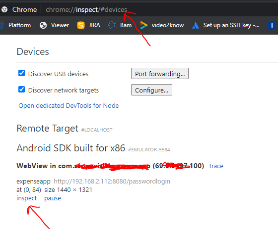

# run a app in the emulator 

download android studio https://developer.android.com/studio

erste schritte:
https://developer.android.com/studio/run/emulator


### How to run a apk (Android Package)?  
Einfach auf die Oberfläche eines Handys von einem gestarteten Emulator ziehen.  


### java version
java version 8 benutzen.
JAVA_HOME auf java 8

### Umgebungsvariable setzen:   
ANDROID_SDK_ROOT = C:\Users\m.k\AppData\Local\Android\Sdk

### AVD Manager
nicht die aktuellste version benutzen:  


ggf. Version 29 verwenden - hier muss bisschen experimentiert werden, um es inital zum laufen zu bekommen

### PANIC: Missing emulator engine program for 'x86' CPU
in den path innerhalb der Systemvariablen seten:  
C:\Users\marko.kovacevic\AppData\Local\Android\Sdk\emulator  
damit man diesen fehler umgeht:  
Quelle: https://stackoverflow.com/questions/49601521/ionic-cordova-run-android-results-in-panic-missing-emulator-engine-program-for

Bei mir reichte der oben aufgeführte Pfad, Thomas meinte daraufhin folgendes:
```
den Fehler kannst du evtl. beheben, wenn du folgende Pfade in deinen Suchpfad (PATH) einträgst:
%ANDROID_SDK_ROOT%\platform-tools;
%ANDROID_SDK_ROOT%\emulator;
%ANDROID_SDK_ROOT%\tools;
%ANDROID_SDK_ROOT%\tools\bin;
```
d.h. falls der Fehler nochmal auftritt, ggf mit den anderen Pfaden probieren

### err_cleartext_not_permitted
  
Um diesen Fehler zu beheben: Änderungen in der `config.xml`   
Abgelegt im Ordner `src-cordova/config.xml`  


### url im quellcode ändern
Folgender Fehler tauchte am Ende noch auf:  


versuche mal die IP 10.0.2.2 zu verwenden, die wird im Emulator auf localhost deines Rechners gemappt.  
baseUrl = "http://10.0.2.2:30000/rest


# View logs of emulator
goal: we want to see the console.log output done within the emulator


du debuggst die App im Emulator mit Chrome auf dem Desktop:
In Chrome chrome://inspect eingeben, etwas warten bis der Emulator als Gerät angezeigt wird, dann wird auch die App angezeigt, diese öffnen und debuggen.





