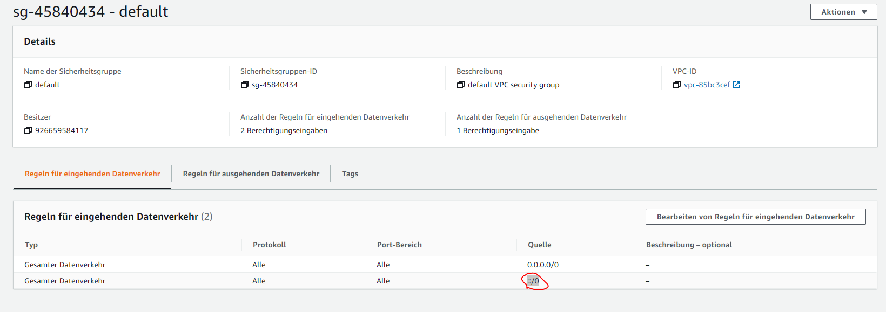

# Beispiel
https://aws.amazon.com/getting-started/hands-on/create-connect-postgresql-db/?nc1=h_ls

Probleme gab es mit der Connection.  
Dies lag an den `VPC security groups`  

Für den eingehenden Datenverkehr wurd ebei der Quelle folgendes eingetragen:  
`::/0`

