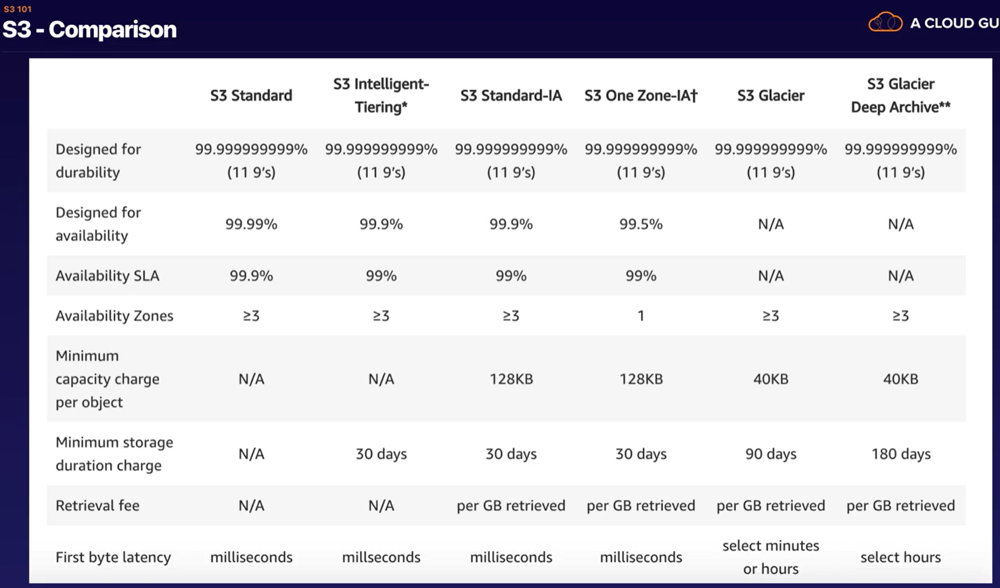
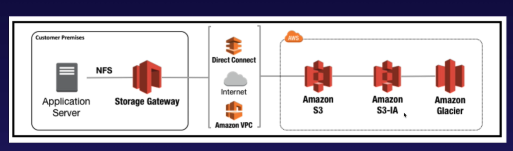

# Udemy Kurs

### Links

https://aws.amazon.com/de/certification/certified-solutions-architect-associate/

# Infos zur Prüfung

- Zum Bestehen brauch man ca. 70% 
- Qualification is valid for 2 years
- Scenario based questions (Keine Wissensabfrage - Was ist xyz)

# ABSCHNITT 2 - 10,000 Foot Overview

### Video 6
- Welche Aufteilung gibt es - Regionen (Frankfurt etc)
- Edge Locations are smaller location used for caching content
- Think of an Availability Zone as a data center

__:bulb:Exam Tip: Understand the diference between a region, an Availability Zone (AT) and an Edge Location.__  
-> Antwort im Video  

-> Amazon Website: https://docs.aws.amazon.com/de_de/AWSEC2/latest/UserGuide/using-regions-availability-zones.html  
-> Amazon Global Infrastructure: https://aws.amazon.com/de/about-aws/global-infrastructure/  

### First Quiz (after Video 7)
1. What is an Amazon VPC?  
Virtual Private Cloud

2. An AWS VPC is a component of which group of AWS services?  
A Virtual Private Cloud (VPC) is a virtual network dedicated to a single AWS account. It is logically isolated from other virtual networks in the AWS cloud, providing compute resources with security and robust networking functionality.

3. What does an AWS Region consist of?  
Each region is a separate geographic area. Each region has multiple, isolated locations known as Availability Zones.

4. Which statement best describes Availability Zones?  
An Availability Zone (AZ) is a distinct location within an AWS Region. Each Region comprises at least two AZs.

5. What is an AWS region?  
A region is a geographical area divided into Availability Zones. Each region contains at least two Availability Zones.

6. Which of the following is correct? (komische darstellung)  
The number of Edge Locations is greater than the number of Availability Zones, which is greater than the number of Regions.

7. In which of the following is CloudFront content cached?  
Edge Location

# Abschnitt 3: Identity Access Management & S3

- login via facebook and linkedin possible   
- MF authentification possible
- temporary access possible
- password rotation possibly
- Supports PCI DCC Complicance

__IAM__ - Identity Access Management

Key Terminology For IAM (Video 8 - Minute 3:10)
- Users  

- Groups  
 
- Policies  
Policies are made up of documents. These documents are in a format calles JSON and they give pormissions as to what a User/Group/Role is ablte to do
 
- Roles  
Allow one AWS-Service to use another AWS-Service  
you can assign policies to roles  

__root account__: account, mit dem man aws angelegt hat.

### Video 09 - IAM Lab
:bulb:__IAM und die Region__  
Wählt man IAM aus, wird die Region auf "Global" gesetzt. Man muss User demnach nicht für einzelne Regionen erstellen.

Was wurde im Video gemacht:
- Benutzer angelegt  
:bulb: __New Users have no permissions when first created__
- Gruppe angelegt
- Benutzer der Gruppe zugeordnet
- Password Policy (Password-Länge, Require at least one lowercase/uppercase/number etc.)
- Role erzeugt

Programatic access: man bekommmt accesss key und secret access key   

### Video 10 - Create A Billing Alarm

Es wurde ein Alarm für die Kosten erstellt.   
E-Mail Benachrichtigung bei Überschreitung von 10$.   

CloudWatch -> Alarms  

Exam-Frage wird in Minute 4:17 gestellt:  
__how can you can get automatic notification if your account goes over 1000000$?!__  
Go into cloud watch and create a billing alarm. Biling alarm uses an SNS-Topic.  

### Video 11 - S3 101

S3 is one of the oldest AWS Services  

S3 = SSS = __S3 stands for Simple Storage Service__  

S3 is Object-based (i.e. allows you to upload files) you can not install an operating system on it(Minute 14:32)  
Key: name of the object - the data of the file  
versionId (mehrere Versionen von Dateien)  
metadata (man kann metadata für files hinterlegen - wie bei centerdevice)

Files can be from 0 to 5 TB  

unlimited storage  

Files are stored in Buckets -  a bucket is a Folder  

Bucket Names must be unique globally (test3 ist wahrscheinlich schon vergeben). Weil für jeden Bucket eine eindeutige Web-Adresse angelegt wird.   

Encryption  

MFA Delete (Need MFA to delete a File)  

:bulb: S3 __Storage Classes - Minute 9:39__
Es gibt unterscheidliche Storage Classes. Sie unterscheiden sich in den Kosten und in der Zugriffsgeschwindigkeit.  
Der günstigste ist __S3 Glacier Deep Archive__. Die Abfrage der Daten dauert 12 Stunden.  
https://aws.amazon.com/de/s3/storage-classes/  

:bulb: S3 (Minute 18:26) __Read S3 FAQs before taking the exam. It comes up A LOT!__  
https://aws.amazon.com/de/s3/faqs/

minute: 15:54  read after write for puts of new objects   
eventual conssistency for overritw puts and deltes (can take some time to propagate)
https://avikdas.com/2020/04/13/scalability-concepts-read-after-write-consistency.html#:~:text=Read%2Dafter%2Dwrite%20consistency%20is,the%20old%20bio%20shows%20up.

### Video 12 - Let`s create an S3 Bucket
Info: S3 does not require region selection.  
Bei der Bucket-Creation kann man eine Region wählen.  
Als Region ist immer "Global" ausgewählt.  

- es wurde ein Bucket erstellt
- eine Datei hochgeladen und für alle zugänglich gemacht

### Video 14 - Security and Encryption
Encryption 
Welche Arten gibt es?  
- Encryption In Transit (Übertragung)

- Encryption At Rest (Server Side)

- you can encrypt files seperate or a whole bucket

### Video 15 - Versioning

- versionierung des Löschens  
Sogar __das Löschen__ einer Datei wird versioniert. Wenn man die Datei wiederherstellen möchte, muss man sich die Versionen anzeigen und den delete-Marker löschen. Dann ist die Datei wieder hergestellt.

### Video 16 - S3 Lifecycle Management and Glacier

Zu finden unter einem Bucket im Reiter __"Management"__  

In einem Lifecyle kann man definieren, was mit den Dateien in einm Bucket passiert.   
Bsp: 
Object wird hochgeladen   ->   Day 30: Object transition to Standard-IA   ->   Objects expire   

Die Dateien werden zwischen Storage Classes hin und her geschoben bzw. gelöscht.  
Das gleiche kann man mit den Versionen einer Datei machen.  

### Video 17 - S3 Lock Policies & Glacier Vault Lock [SAA-C02]

Begriff: WORM = write once, read many  

- damit kann verhindern, dass Objekte geändert werden.  

__THE OBJECT LOCK__

es gibt unterschiedliche Modes:  
- Governance Mode  
Die Dateien sind vor den meisten Usern geschützt. Man kann aber einigen Usern Berechtigungen geben, um diese Dateien zu ändern.  
With governance mode, users cant overwrite or delete an object version or alter its lock settings unless they have special permissions.  

- Compliance Mode  
a protected object version can´t be overwritten or deleted by any user. including the roor ser in your aws account.  

__RETENTION PERIODS__  
A retention period protects an object version for a fixed amount of time.  

__Legal Holds__  
S3 Object Lock also enables you to place a legal hold on an object version. Like a retention period, a legal hold prevents an object version from being overwritten or deleted. 
However, a legal hold doesnt have an associated retention period and remains in effect until removed.  

__Glacier Vault Lock__  
allows you to easily deploy and enforce eompliance controls for individual S3 glacier vaults with a valut lock policy. you can specify controls such as WORM in a vault lock policy and lock the policy from future edits. Once locked, the policy can no longer be changed.  

### Video 18 - S3 Perfomance

What is a prefix with S3?  
_mybucketname/folder1/subfolder1/myfile.jpg_ the prefix is: __/folder1/subfolder1__

If you are using SSE (Server Side Encryption)-KMS to encrypt your objects in S3, you must keep in mind the KMS limits.  
- Uploading/Downloading will count towards the KMS quota
- Region-specific, however, its either 5,500 , 10,000 or 30,000 requests per second
- Currently, you cannot request a quota increase for KMS

MULTIPART  
- Use multipart uploads to increase performance when uploading files to S3
- Should be used for any files over 100MB and must be used for any files over 5GB
- Use S3 byte-range fetches to increase performance when downloading files to S3

### Video 19 - S3 Select & Glacier Select
kurzes video  
man kann nur teile einer Datei laden. damit bekommt man einen performance boost.  
bsp: man hat eine zip-datei mit einer csv. anstatt die ganze datei zu laden, kann man sql-ähnlich nur teile der datei laden.  

- s3 select is used to retrieve only a subset of data from an object by using simple SQL expressions
- get data by rows or columns using simple sql expressions
- save money on data transfer and increase speed

### Video 20 - Aws Organisations
zeigt wie man ein organisationsaccount erstellt und weitere accounts einlädt.

### Video 21 - Sharing S3 Bucktes between Accounts

### Video 22 - Cross Region Replication

To do the Replication, we need to create a new bucket and select a other region as the "original" - Bucket.  
!! Requirement: the target bucket must support versioning!!  

you can do replication for buckets in the same aws account and for buckets in another aws account.

go into the bucket you want to replicate under "Management". There you can find "Replication rules".  
you can define in wich storage class (Standard, Standard-IA ...) in which the files schould be moved.  

are files in a bucket and you turn the repplication on afterwards, the existing files will not be replicated. Only new files starting at the moment you created the replication rule.  

if you cange the permission in the source-bucket it doesnt change the permission in the destination bucket.  

__EXAM TIP__
- Versioning must be enabled on both the source and destination buckets
- Files in an existing bucket are not replicated automatically
- All ssubsequent updated files will be replicated automatically
- Delete markers are not replicated
- Deleting individual versions or delete markers will not be replicated
- Understand what Cross Region Replication is at a high level

### Video 23 - Transfer Acceleration
What is S3 Transfer Acceleration?  

S3 Transfer Acceleration utilises the CloudFront Edge Networt to accelerate your uploads to S3.   
Instead of uploading directly to your S3 bucket, you can use a distinct URL to upload directly to an edge location which will then transfer that file to S3. 
You will get a distinct URL to upload to.  

es gibt eine Testpage um den Speedvorteil von Transfer Acceleration zu testen. Wieviel Speed man dadurch gewinnt: https://s3-accelerate-speedtest.s3-accelerate.amazonaws.com/en/accelerate-speed-comparsion.html  

### Video 24 - DataSync Overview
its a way to sync your data to AWS.  

__EXAM TIP__
- Used to move large amounts of data from on-premises to AWS
- Used with NFS- and SMB-compatible file systems
- Replication can be done hourly, daily, or weekly
- Install the DataSync agent to start the replication
- Can be used to replicate EFS to EFS

⚠️ __how can you move from onPrem to aws?__
with DataSync

### Video 25 - CloudFront Overview

__What is CloudFront__  
A content delivery network (CDN) is a system of distributed servers (network) that deliver webpages and other web content to a user based on the geographic locations of the user, the origin of the webpage, and a content delivery server. 

__Cloud Front - Key Terminology__

- __Edge Location__  
This is the location where content will be cached. This is separate to an AWS Region/AZ.
At the end of the video the info: Edge locations are not just READ only - you can write to them too (ie put an object on to them)  

- __Origin__   
This is the origin of all the files that the CDN will distribute. This can be an S3 Bucket, an EC2 Instance, an Elastic Load Balancer, or Route53.

- __Distribution__   
This is the name given the CDN which consists of a collection of Edge Locations

__Again - What is CloudFront__  
Amazon CloudFront can be used to deliver your entire website, including dynamic, static, streaming, and interactive content using a global network of edge locations. Requests for your content are automatically routed to the nearest edge location, so content is delivered with the best possible performance.  

- Objects are chaced for the TTL (Time to Live) [Minute 4:28]
- You can clear cached objects, but you will be charged

Different Types of distribution:  
- Web Distribution - Typically used for Websites
- RTMP - Used for Media Streaming

### Video 26 - CloudFront Lab
ein lab.  
für ein S3-Bucket wird ein CloudFront angelegt.  
__Das Anlegen dauert lange!!!__  (ca 1 Stunde)  

### Video 27 - CloudFront Signed URLs and Cookies [SAA-CO2]

:x: WIEDERHOLEN! :x: 

Was ist eine signed url:  
https://liveroomlk.medium.com/cloudfront-signed-urls-cookies-and-s3-presigned-urls-be850c34f9ce#:~:text=Signed%20URL%20is%20a%20url,while%20url%20locates%20the%20resource.&text=With%20a%20signed%20URL%20a,RSA%2DSHA1%20algorithm%20is%20used.

### Video 28 - Snowball Overview

Snowball is for moving large amount of data into the aws cloud.  

:question: Es sind also große Festplatten die man bekommt, auf die man seine Daten packt und zu Amazon schickt?!  

### Video 29 - Snowball Lab

__Optionales Video__ - nicht Prüfungsrelevant  
hier kann man so ein Snowball sehen.  

### Video 30 - Storage Gateway

__What is storage Gateway?__  
Aws Storage Gateway is a service that connects an on-premises software appliance with cloud-based storage to provide seamless and secure integration between an organization`s on premises IT environment and AWS storage infrastructure. The service enables you to securely store data to the AWS cloud for scalable and cost-effective storage.

Three types of Storage Gateway:   
- File Gateway (NFS & SMB) - For flat files, stored directly on S3
- Volume Gateway (iSCSI)
     -  Stored Volumes  
        Entire Dataset is stored on site and is asynchronously backed up to S3   
        
     -  Cached Volumes  
        Entire Dataset is stored on S3 and the most frequently accessed data is cached on site.   
        
- Tape Gateway

### Video 31 - Athena vs Macie
__What is Athena__  
Interactive query service which enables you to analyse and query data located in S3 using standard SQL   
- Serverless, nothing to provision, pay per query / per TB scanned
- No need to set up complex Extract/Transform/Load (ETL) processses
- Works directly with data stored in S3 

__What can Athena be used for?__   
- Can be used to query log files stored in S3, e.g. ELB logs, S3 access logs etc
- Generate business reports on data stored in S3
- Analyse AWS cost and usage reports 
- Run queries on click-stream data

__Athena EXAM TIP__:   
Remember what Athena is and what it allows you to do:   
- Athena is an interactice query service
- It allows you to query data located in S3 using standard SQL
- Serverless
- Commonly used to analyse log data stored in S3

__What is Macie?__  
first we need to know what PII is:   

__What is PII?__   
- Personal data used to establish an individuals identiy
- This data could be exploited by criminales, used in identity theft and financial faud
- Home address, email address, SSN
- Passport number, drivers license number
- D.O.B., phone number, bank account credit card number

__What is Macie?__  
Security service which uses Machine Learning and NLP (Natural Language Processing) to discover, classify and protect sensitive data stored in S3.   
- Uses AI to recognise if your S3 objects contain sensitive data such as PII
- Dashboards, reporting and alerts
- Works directly with data stored in S3
- Can also analyze CloudTrail logs
- Great for PCI-DSS and preventing ID theft

__Macine Exam Tip__
Remember what Macie is and what it allows you to do:   
- Macie uses AI to analyse data in S3 and helps identify PII
- Can also be used to analyse CloudTraill logs for suspicious API activity
- includes Dashboards, Reports and Alerting
- Great for PCI-DSS compliance and preventing ID theft

