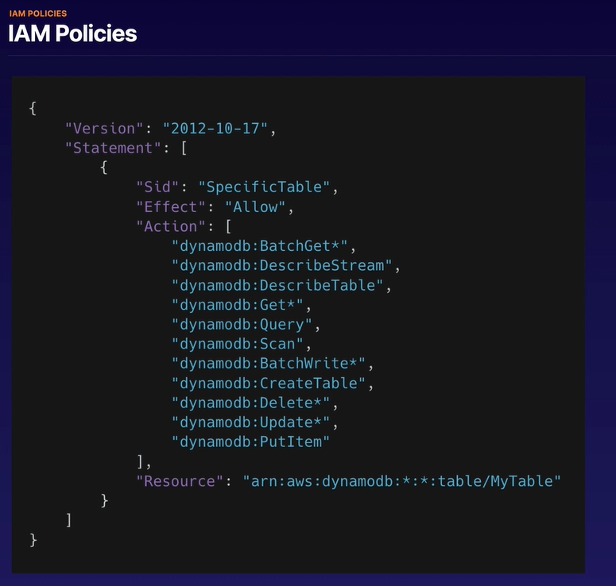
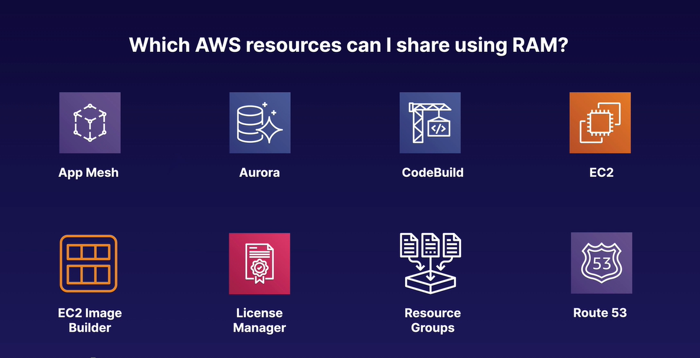
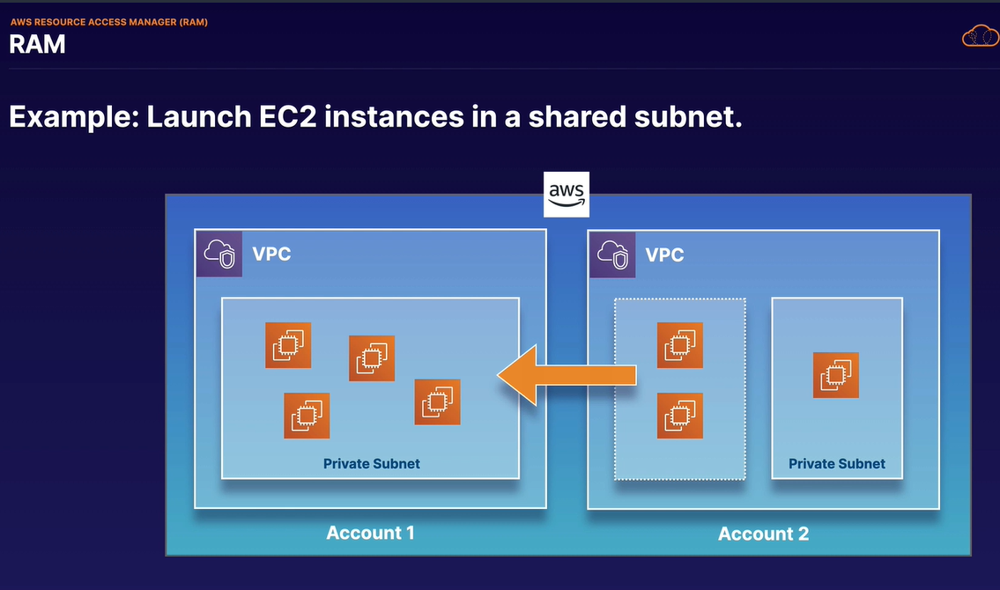

# Abschnitt 6: Advanced IAM

### Video 70 - AWS Directory Service
⚠️⚠️⚠️⚠️WIEDERHOLEN⚠️⚠️⚠️⚠️⚠️⚠️

- Microsoft Centric Topic

__What is AWS Directory Service ?__   
- Family of managed services (not a single service)
- Connect AWS resources with on-premises AD (Active Directory)
- Standalone directory in the cloud
- Use existing corporate credentials 
- SSO to any domain-joined EC2 instance (SSO = Single Sing On)

__What is Active Directory ?__  

- On-premises directory service
- Hierarchical database of users, groups,   
  computers - __trees__ and __forests__  
  
- Group polices
- LDAP and DNS (under the hood AD is based on two protocols)  
- Kerberos, LDAP, and NTLM authentication protocolls
- Highly available

__further infos__  
What is active directory?   

### Video 71 - AWS Policies

__ARN__  

ARN = Amazon Resource Name 

ARNs all begin with:
arn:partition:service:regtion:account_id:  

service: s3 | ec2 | rds  
region: us-east-1 | eu-central-1  
account_id_ 123456789012  

__EXAM TIPS__  
- Not explicitly allowed == implicitly denied  
- Explicit deny > everything else
- Only attached policies have effect
- AWS joins all applicable policies
- AWS-managed vs customer-mamanged

__Permission Boundaries__  

schränkt die Berechtigungen ein.  Hat ein User z.b. AdministratorAccess und man setzt als Permission boundary "AmazonDynamoDBFullAccess"   
kann er trotz des Admin-Rechts nur auf AmazonDynamoDB zugreifen.   

  

__Effect__  
is __allow__ or __deny__  

__Action__  
serviceName : Actionname  

__Resource__  
The Resource the Action is against  
-> against the table: MyTable

### Video 72 - Resource Access Manager (RAM)

AWS Resource Access Manager (RAM) allows resource sharing between accounts.   

  

  

Im Video wurde eine Datenbank mit einem anderen Account geteilt.   

### Video 73 - AWS Single Sign-On

SSO = Single Sign On

if you see SAML 2.0 in an exam question - look for SSO in on of the answers

