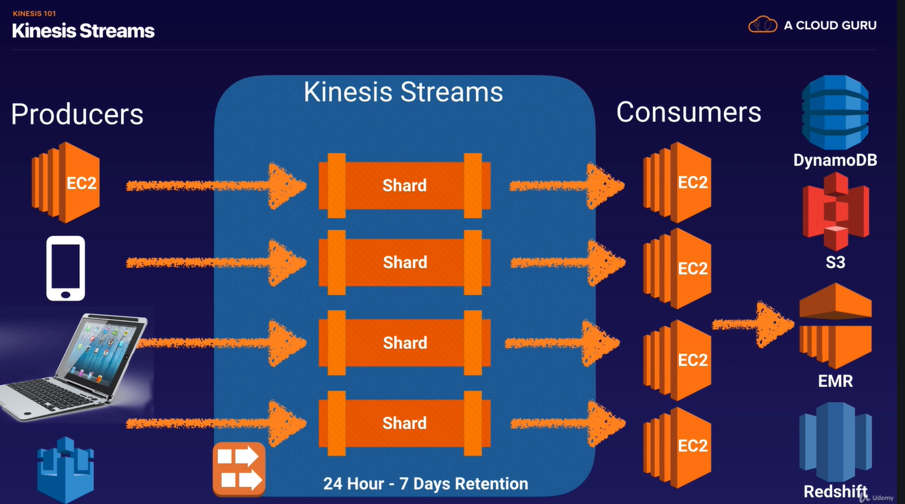
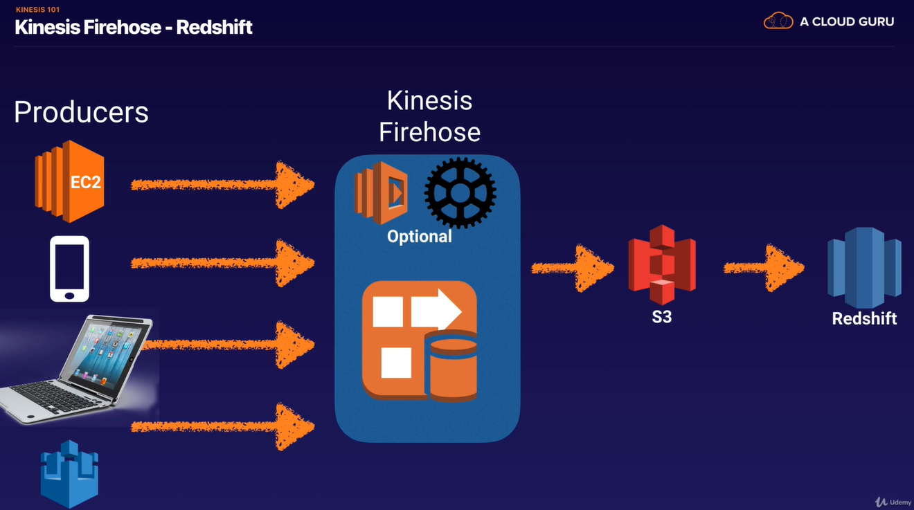
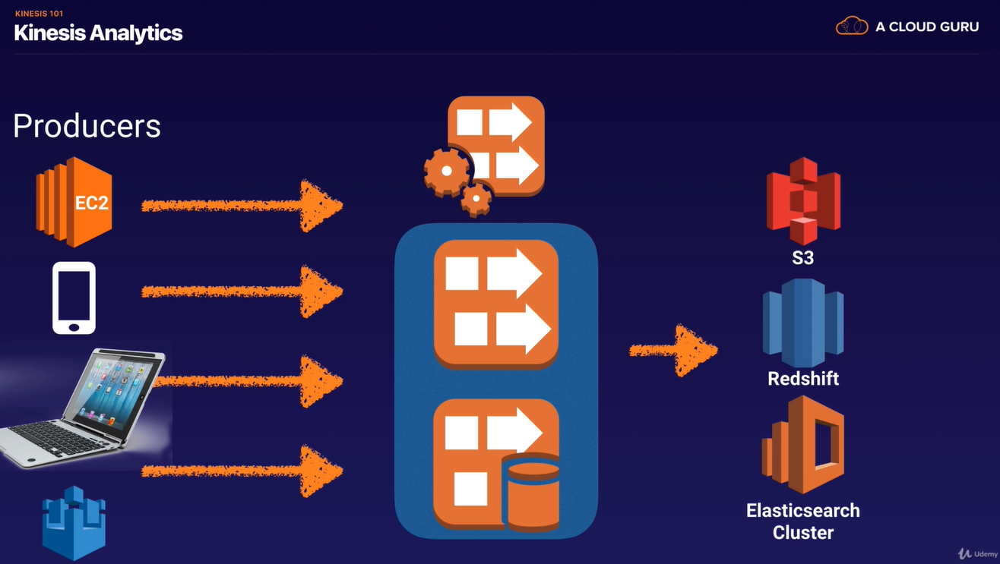

### Kinesis

### What is Streaming Data?
Streaming Data is data that is generated continuously by thousands of data sources, 
which typically send in the data records simultaneously, and in small sizes (order of Kilobytes).

Streaming data:   
- Purchases from online stores (think amazon.com)
- Stock Prices (Aktienkurse)
- Game data (as the gamer plays)
- Sozial network data
- Geospatial data (think uber.com)
- iOT sensor data

### What is Kinesis?
Amazon Kinesis is a platform on AWS to __send your streaming data__ to.
Kinesis makes it easy to load and analyze streaming data, 
and also providing the ability for you to build your own custom apllications for you business needs.

-> a place to send your streaming data to

### 3 Different Types of Kinesis
- Kinesis Streams
- Kinesis Firehose
- Kinesis Analytics

-> for the exam you need to know the 3 different type of kinesis and what you should use where  

### Kinesis Streams

- By default Kinesis Streams stores data for 24 hours - it can store it up to 7 Days   
- Data is contained in Shards
- You have a Shard for different purposes (for stock market, for iot, etc...)

#### Kinesis Streams Consists of Shades
- 5 transactions per second for reads, up to a maximum total data read rate of 2 MB per second and up to 1000 recors per second for writes, up to a maximum total data write rate of 1MB per second (including partition keys)

- The data capacity of your stream is a function of the number of shards that you specify for the stream. The total capacity of the stream is the sum of the capacities of its shards.

(you dont need the both points above for the exam)   

### Kinesis Firehose

- there are no persistence storage. the data has to be alanyzed as it comes in. You have to do something with your data.
- its optional to have lambda functions inside your kinesis firehose 
- so soon the data comes in - it triggers a lambda function - the lambda function runs a particular set of code for that data and output it somewhere safe

### Kinesis Analytics
Works with "Kinesis Strems" and "Kinesis Firehose" and it essentially it can analyse the data on the fly inside eather service.
And then stores the data inside S3, Redshift or Elasticsearch Cluster

#### Exam Tips:

- Know the difference between Kinesis Streams and Kinesis Firehose.  
You will be given scenario questions and you must choose the most relevant service.   

- Understand what Kinesis Analytics is
