### Video 57 - Databases 101

__RDS__ = Relational Databases

__relational databases__  
SQL Server, Oracle, MySQL Server, PostgreSQL, Aurora,MariaDB

RDS has two key features;
- multi-az-for disaster recovery
- Read Replicas - For Performance

__Non Relational databases__  
Collection      = table
Documnet        = row
Key Value Pairs = Fields

__What is a Data Warehosing?__  
Used for business intelligence. Tools like Cognos, Jaspersoft, SQL Server Reporting Services, Oracle Hyperion, SAP NetWeaver

Used to pull in very large and complex data sets. Usually used by management to do queries on data (such as current performance vs targets etc)

__ElastiCache__  
siehe video

### Video 58 - Lets create a RDS instance

⚠️⚠️⚠️⚠️⚠️ Man muss die im Video angegebene MySQL-Version benutzen (nicht die aktuelle) sonst funktioniert es nicht!!!   

- Es wurde eine MySQL Datenbank erstellt 
- Es wurde eine EC2 instance erstellt mit wordpress (konfigurationsscript)
- Berechtigung erstellt, dass die EC2 auf die DB zugreifen kann
- WordPress konfiguriert

__EXAM TIPS__  
- RDS runs on virtual machines (you dont have any access to these virtual mashines, you cant ssh into the mashiens)
- You cannot log in to these operating systems however
- Patching of the RDS Operationg System and DB is Amazons responsibility
- RDS is NOT Serverless 
- Aurora Serverless IS Serverless

### Video 59 RDS Backups Multi-AZ & Read Replicas

Two Types of Backups:
- Automated Backups
- Database Snapshots

__Database Snapshots__  

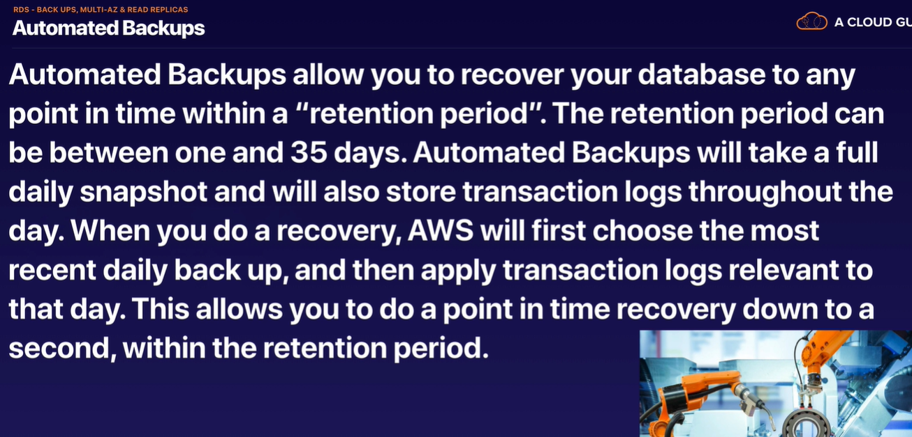

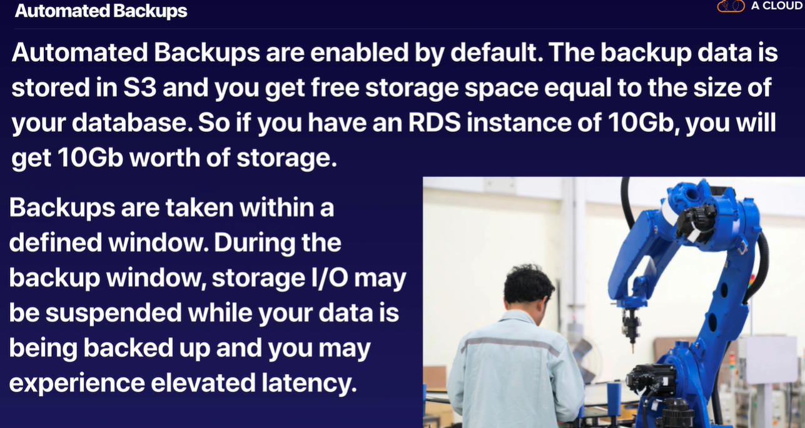

__Database Snapshots__  
DB Snapshots are done manually (ie they are user initiated.) They are stored even after you delete the originbal RDS instance, unlike automated backups.  

__Encryption at Rest__  
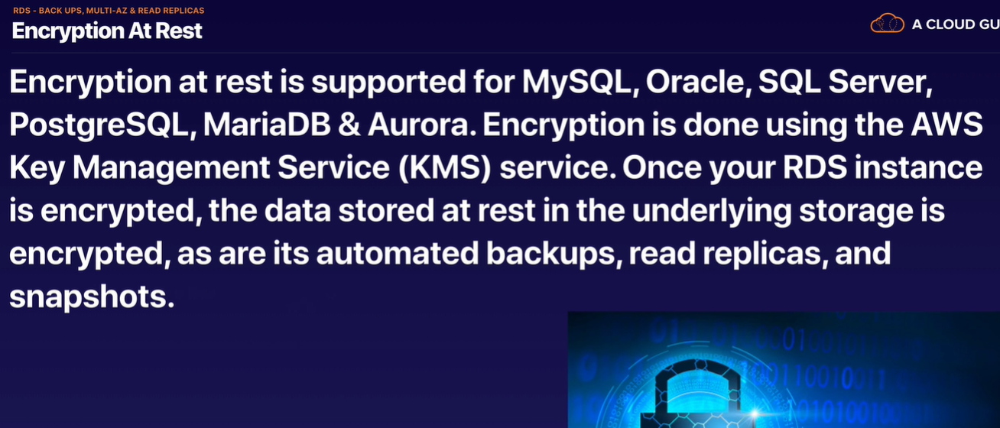

__Multi AZ__

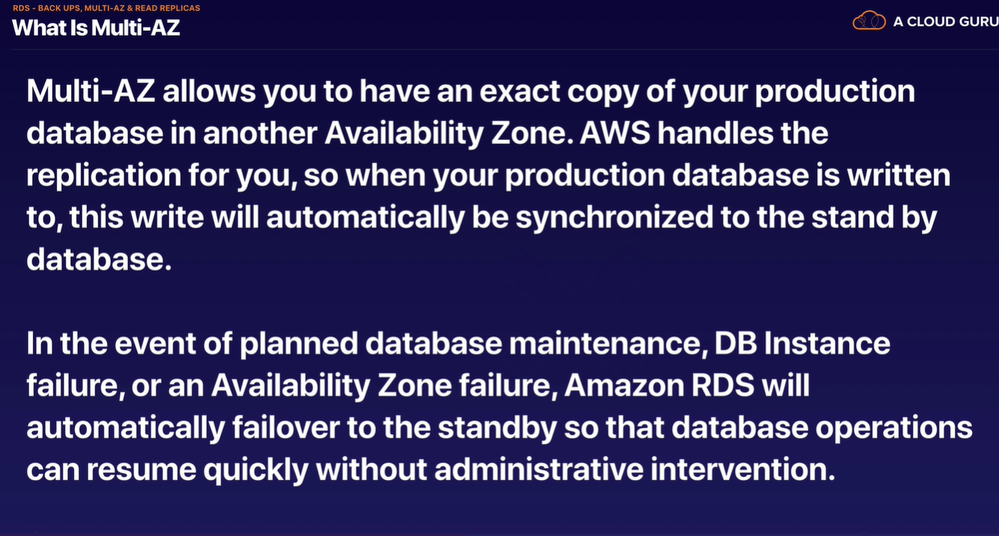

__Multi-AZ is for Disaster Recovery only__  
It is not primarily used for improving perormance. For performance improvment, you need Read Replicas

__READ REPLICA__  
Read from diferent read replicas and only write a single database. These writes will be replicated out.  

Q: Exam Question: how can you improve performance of a database?   
A: add read replica, start elastic cache

Things to know about Read Replicas:  
- Used for scaling, not for DR! (DR = Desaster Recovery)
- Must have automatic backups turned on in order to deploy a read replica
- You can have up to 5 read repica copies of any database
- You can have read replicas of read replicas (but watch out for latency)
- Each read replica will have its own DNS end point
- You can have read replica that have Multi-AZ
- You can create read replicas of Multi-AZ source databases
- Read replicas can be promoted to be their own databases. This breaks the replication
- You can have a read replica in a second region

### Video 60 - RDS Backup, Multi-AZ & Read Replicas -Lab
__EXAM TIPS__  

Read Replicas:  
- Can be Multi-AZ
- Used to increase performance
- Must have backups turned on
- Can be in different regiions 
- Can be MySQL, PostgreSQL, MariaDB, Oracle, Aurora
- Can be promoted to master, this will break the Read Replica

Multi AZ:   
- Used for DR (DR = Disaster Recovery)
- You can force a failover from one AZ to another by rebooting the RDS instance.   

### Video 61 - DynamoDB

NoSQL Database   

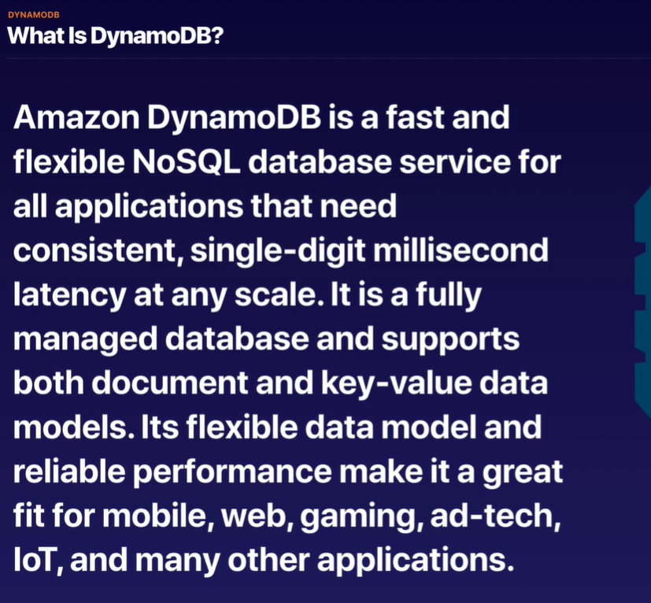

__Basics of DynamoDB:__   
- Stored on SSD storage
- Spread across 3 geographically distinct data centers
- Eventual Consistent Reads (Default)
- Strongly Consistent Reads

__Eventual Consistent__   
Consistency across all copies of data is usually reached within a second. Repeating a read after a short time should return the udpdated data. (Best Read Performance)

__Strongly Consistent Reads__   
A strongly consistent read returns a result that reflects all writes that received a successful respnonse prior to the read.

### Video 62 - Advanced DynamoDB

__DynamoDB Accelerator (DAX)__  

- Fullly managed, highly available, in-memory cache
- 10x performance improvment
- Reduces request time from milliseconds to microseconds - even under load
- No need for developers to manage caching logic
- Compatible with DynamoDB API calls

__Transactions__  
- Multiple "all or nothing" operations
- Financial transactions
- Fullfilling orders
- Two underlying reads or writes - prepare/commit
- Up to 25 items or 4MB od data

__On-Demand Capacity__  
- Pay-per-request pricing
- Balance cost and performance
- No minimum capacity
- No charge for read/write - only storage and backups
- Pay more per request than with provisioned capacity
- Use for new product launches

__On-Demand Backup and Restore__   
-> siehe video

__Point-in-time recovery (PITR)__  
-> siehe video

__Streams__   
-> siehe video  

__Global Tables__  
-> siehe video

__Database Migration Service (DMS)__  
-> siehe video

__Security__  
-> siehe video

### Video 63 - Redshift

Data Warehouse   

What is Redshift   
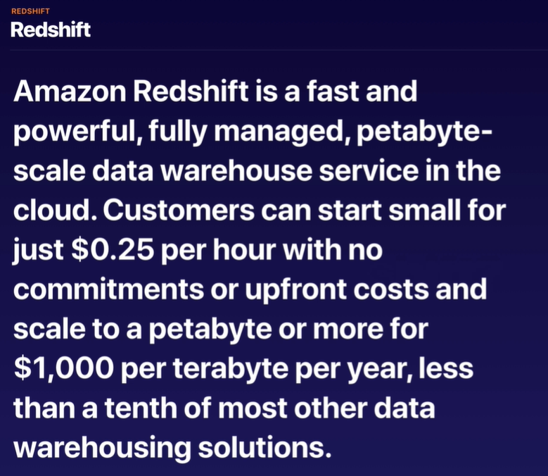

__OLTP vs OLAP__  

__EXAM TIPS__  
- Redshift is used for business intelligence
- Available in only 1 AZ

Backups:   
- Enabled by default with a 1 day retention period (Aufbewahrungsfrist)
- Maximum retention period is 35 days
- Redshift always attempts to maintain at least three copies of your data (the original and replica on the comute nodes and backup in Amazon S3)
- Redshift can also asynchronously replicate your snapshot to S3 in another region for disaster recovery

### Video 64. Aurora
Amazon created DB  

__What is Aurora?__  
Amazon Aurora is a MySQL and PostgreSQL-compatible relational database engine that combines the speed and availability of high-end commercial databases with the simplicity and cost-effectiveness of open source databases.  

 

__EXAM TIPS__  

### Video 65 Elasticache
ElastiCache is a web service that makes it easy to deploy, operate, and scale an in-memory cache in the cloud.  
The service improves the performance of web applications by allowing you to retieve informaiton from fast, 
managed, in-memory caches, instead of relying entirely on slower disk-based databases.   

__ElastiCache supports two open-source in-memory caching engines__
- Memcached
- Redis

__EXAM TIPS__  
- Use Elasticache to increase database and web application performance
- Redis is Multi-AZ
- You can do backups and restores of Redis

### Video 66 - Database Migration Services (DMS)

__What is DMS?__  
AWS Database Migration Service (DMS) is a cloud service that makes it easy to migrate relational databases, data warehouses, NoSQL databases, and other types of data stores. 
You can use AWS DMS to migrate your data into the AWS Cloud, between on-premises instances (through an AWS Cloud setup), or between combinations of cloud and on-premises setups.

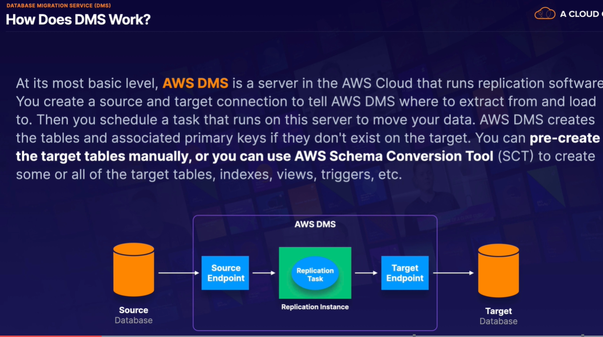

further infos about the pic:   
the left db can be on premise and the right can be in the cloud   

__Types of Migration__ 

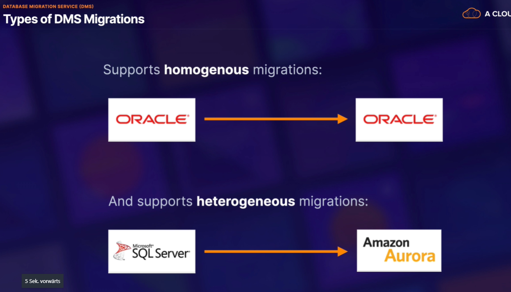

AWS Schema Conversion Tool  
You do not need SCT if you are migrating to identical databases    
Questions in the Exam, when you need SCT (Schema Conversion Tool)

__Source and Targets__   

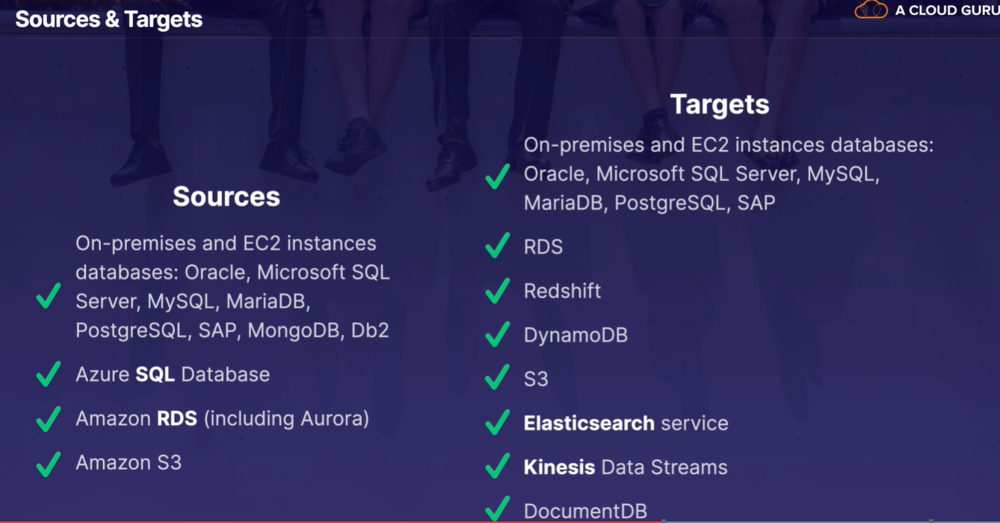

__EXAM TIPS__   
- DMS allows you to migrate databases from one source to AWS
- The source can either be on-premises, or inside AWS itself or anther cloud provider such as Azure
- You can do homogenous migrations (same DB engines) or heterogeneous migrations.
- If you do a heterogeneous migration, you will need the AWS Schema Convertsion Tool (SCT)

### Video 67 Caching Strateies on AWS   

The following services have caching capabilities:   

- CloudFront
- API Gateway
- ElastiCache - Memcached and Redis
- DynamoDB Accelerator (DAX)

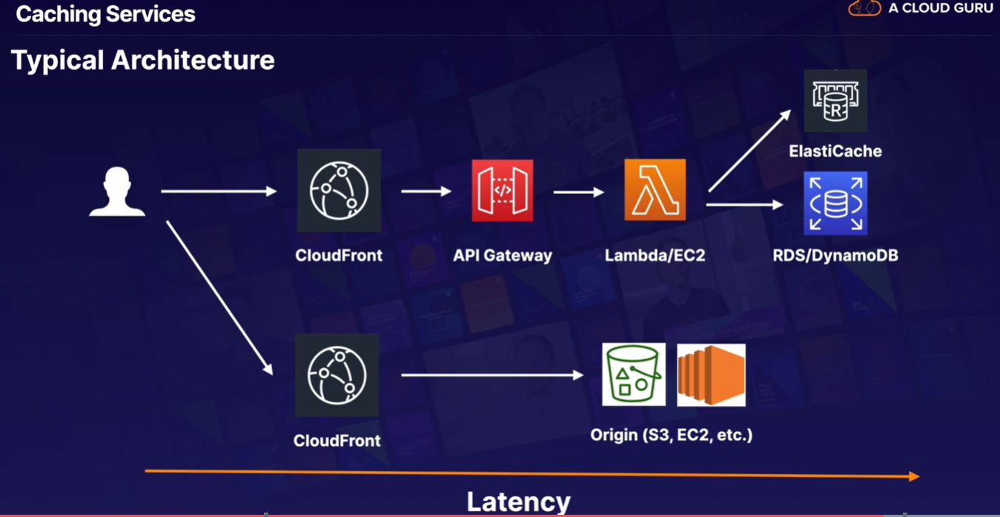

Caching is a balancing act between up-to-date, accurate information and latency. We can use the following services to cache on AWS_
- CloudFront
- API Gateway
- ElastiCache - Memcached and Redis
- DynamoDB Accelerator (DAX)

### Video 68 - EMR Overview

__What is EMR?__  
EMR = Amazon Elastic MapReduce   

-> BigData Thema

Amazon EMR is the industry-leading cloud big data platform for processing vast amounts of data using open-source tools such as Apache Spark, Apache Hive, Apache HBase, Apache Flink, Apache Hudi, and Presto. 
With EMR, you can run petabyte-scale analysis at less than half the cost of traditional on-premises solutions and over three times faster than standard Apache Spark.

The central component of Amazon EMR is the cluster. A cluster is a collection of Amazon Elastic Compute Cloud (Amazon EC2) instances. Each instance in the cluster is called a node. Each node has a role within the cluster, referred to as the node type.   

Amazon EMR also installs different software components on each node type, giving each node a role in a distributed application like Apache Hadoop.   

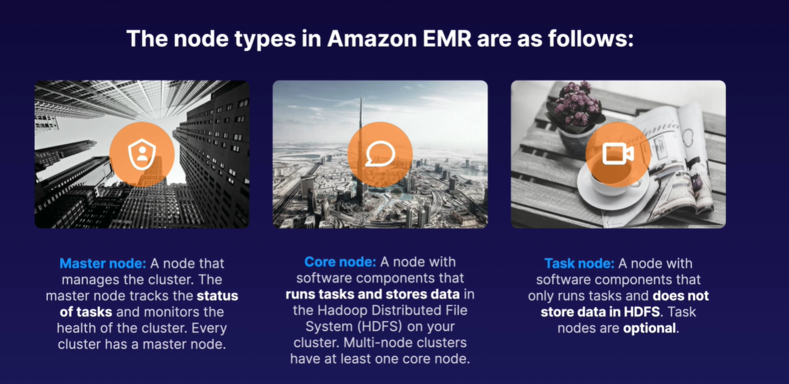

__EXAM TIPS__  
- EMR is used for big data processing
- Consists of a master node, a core node, and (optionally) a task node
- By default, log data is stored on the master node
- You can configure replication to S3 on __five-minute intervals for all log data from the master node__; however, this can only be configured when creating the cluster for the first time

