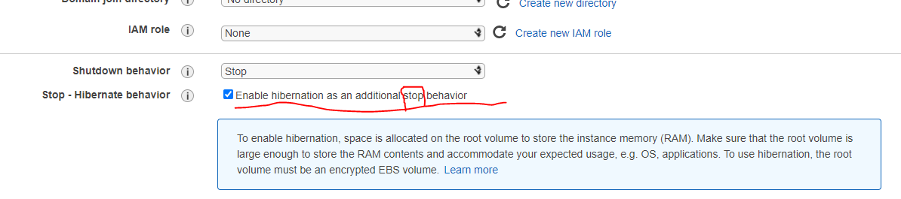

# EC2 - Elastic Compute Cloud

EC2 unter der Kategorie "Compute"   

### Video 33 - EC2

__What is EC2?__  

EC2 are virtual mashines in the cloud   

Amazon Elastic Compute Cloud (Amazon EC2) is a web service that provides resizable compute capacity in the cloud. Amazon EC2 reduces the time required to obtain and boot new server instances to minutes, allowing you to quickly scale capacity, both up an down, as your computing requirements change.  

__EC2 Pricing Models__  
💡 Weitere erklärung siehe Video

- __On Demand__  
Allows you to pay a fixed rate by the hour (or by the second) with no commitment.  

- __Reserved__  
Provides you with a capacity reservation, and offer a significant discount on the hourly charge for an instance. Contract Terms are 1 Year or 3 Year Terms.  

- __Spot__  
Enables you to bid whatever price you want for instance capacity, providing for even greater savings if you applications have flexible start and end times.

- __Dedicated Hosts__  
Physical EC2 server dedicated for your use. Dedicated Hosts can help you reduce costs by allowing you to use your existing server-bound __software licenses__

### Video 34 Lets get our hands dirty with ec22
EC2 unter der Kategorie "Compute"   

first we need to choos a Amazon Machine Image (AMI)   

- es wurde ein betriebssystem ausgewählt
- man hat sich mit ssh mit der instanz verbunden
- es wurde ein tool für chrome vorgestellt um die ssh verbindung herzustellen
- es wurde ein privater und ein öffentlicher schlüssel erzeugt
- auf der instanz wurde ein apache-server erstellt und zur verfügung gestellt - eine testpage erstellt
- über den browser auf die instanz zugegriffen. die ip bekommt man in der aws-seite

__in der ssh konsole eingegeben:__  
- sudo su
- yum update -y      //um updates einzuspielen
- yum install httpd -y // install apache
- cd /var/www/html
- <add index.html>
- service httpd start  //start apache
- chkconfig on  //start service if the system reboots
- 

### Video 36 Security Groups Basics

Es wurden auf der EC2-Instanz die Ports (80) - für HTTP geschlossen und versucht auf die öffentliche IP zuzugreifen (auf der instanz läuft ein apache server)   

💡 rule change on security groups take effect immediately

- inbound rule
- outbound rule 

💡 when you delete the default rule in the outbound rule, nothing happens. Because: When you create a inbound rule a outbound rule is created automatically!!
that means when you allow http in, its automatically allowed http out as well  

- with security groups you cant block individual ip adresses
- you cant block an individual port

in a security is everything blocked by default. you have to allow things

__EXAM TIPS__  

- All Inbound traffic is blokced by default
- All OUtbound traffic is allowed
- Changes to Security Groups take effect immediatley
- You can have any number of EC2 instances within a security group
- You can have multiple security groups attached to EC2 instances

- 💡 Security Groups are __STATEFULL__  (that means you dount have to change inbound and outbound ports!! - outbounds are set automatically, if inbounds are set)
- If you create an inbound rule allowing traffic in, that traffic is automatically allowed back out again
- You cannot block specific IP addresses using Security Groups, instead use Network Access Control Lists
- You can specify allow rules, but not deny rules on a security group

### Video 37. EBS 101

__What is EBS?__  
Amazon Elastic Block Store (EBS) provides persistent block storage volumes for use with Amazon EC2 instances in the AWS Cloud. Each Amazon EBS volume is automatically replicated within its Availability Zone to protect you from component failure, offering high availability and durability.  

- its a virtual hard disk in the cloud

__5 Different Types of EBS Storage__  

- General Purpose SSD
- Provisioned IOPS (SSD)
- Throughput Optimised Hard Disk Drive [its magnetic]
- Cold Hard Disk Drive [its magnetic]
- magnetic

__Further Information__  
i asked myself what the difference between s3 and ebs is. here a link:  
https://www.missioncloud.com/blog/resource-amazon-ebs-vs-efs-vs-s3-picking-the-best-aws-storage-option-for-your-business  

https://dzone.com/articles/confused-by-aws-storage-options-s3-ebs-amp-efs-explained

### Video 38 - Volumes & Snapshots

💡 the volumne is always in the same availability zone as the ec2 instance. this also make sense because of the performance.  

we created a snapshot. from a snapshop you can create an image or volume  

AMI - Amazon Mashine Image  

move instance from one Availability Zone to another - and move into another region by snapshotting and starting the AMI

__EXAM TIPS__  
- Volumes exist on EBS. Think of EBS as virtual hard disk
- Snapshot exist on __S3__. Think of snapshots as a photograph of the disk
- Snapshots are point in time copies of Volumes
- Snapshots are incremental - this means that only the blocks that have changed since your last snapshot are moved to S3
- If this is your first snapshot, it may take some time to create
- To create a snapshot for Amazon EBS volumes that serve as root devices, you should stop the instance before taking the snapshot
- However you can take a snap while the instance is running
- You can create AMI´s from Snapshots 
- You can change EBS volume sizes on the fly, including changing the size and storage type
- Volumes will ALWAYS be in the same availabitlity zone as the EC2 instance
- To move an EC2 volume from one AZ to another, take a snapshot of it, create an AMI from the snapshot and then use the AMI to launch the EC2 instance in a new AZ
- To move an EC2 volume from one region to another, take a snapshot of it, create an AMI from the snapshot and then copy the AMI from one region to the other. Then use the copied AMI to launch the new EC2 instance in the new region.

### Video 39 - AMI Types (EBS vs Instance Store)

⚠️ was ist instance store??? instance store volumes!?  

__EXAM TIP__  
- Instance Store Volumes are sometimes calles Ephemeral (flüchtig) Storage
- Instance store volumes cannot be stopped. If the underlying host fails, you will lose your data
- EBS backed instances can be stopped. You will not lose the data on this instance if it is stopped
- You can reboot both, you will not lose your data
- By default, both ROOT volumes will be deleted on termination. However with EBS volumes, you can tell AWS to keep the root device volume.

### Video 40 ENI vs ENA vs EFA 

💡 viele folien mit erklärungen im video

- __ENI__   
Elastic Network Interface - essentially a virtual network card

- __EN__  
Enhanced Networking. Uses single root I/O virtualization (SR-IOV) to provide high-performance networking capabilities on supported instance types.

- __Elastic Fabric Adapter__  
A network device that you can attach to your Amazon EC2 instance to accelerate High Performance Computing (HPC) and machine learning applications.

__Scenarios for Network interfaces__  
- Create a management network
- Use network and security applicances in your APC
- Create dual-homed instances with workloads/role on distinct subnets
- create a low-budget, high-availability solution

__EXAM TIPS__  

   

### Video 41. Encrypted Root Device Volumes & Snapshots

💡 __Root Device__: the hard disk that has your operating system on it  

  

we created a ec2 instance with a storage. the storage was unencrypted. but you can set an encryption when defining the storage. but this video shows the encryption afterwards.  for that you create an snapshop and then copy that snapshot defining the encryption  

Snapshot -> *create Image* -> AMI -> lauch instance from AMI  

__EXAM TIPS__  
- Snapshots of encrypted volumes are encrypted automatically
- Volumes restored from encrypted snapshots are encrypted automatically
- you can share snapshots, but only if they are unencrypted
- These snapshots can be shared with other AWS accounts or made public 
- You can now encrypt root device volumes upon creation of the EC2 instance

you got an running unencrypted root device and want to encrypt it:   
- Create a Snapshot of the unencrypted root device volume
- Create a copy of the Snapshot and select the encrypt option
- Create an AMI from the encrypted Snapshot
- Use that AMI to launch new encrypted instances

### Spot Instances & Spot Fleet

  

   

   

💡weitere infos im video
Dieser Link wurde auch im Video erwähnt:  
https://docs.aws.amazon.com/AWSEC2/latest/UserGuide/spot-requests.html

   

__EXAM TIP__  

   

### Video 43 - EC2 Hibernate

   

   

With EC2 Hibernate, the instance boots much faster. The operating system does not need to reboot because the in-memory state (RAM) is preserved. This is useful for:  
- Long-running processes
- Services that take time to initialize

How to setup hibernation for a new created instance:   

__Exam Tip__  

### Video 44 AWS THIS WEEK
updates what changed in aws:    
acloud.guru/aws-this-week  

### Video 45 - CloudWatch 101

CloudWatch monitors performance  

__CloudWatch and EC2__  

__CloudWatch VS CloudTrail__  

💡
CloudWatch monitors performance  
  
  
CloudTrail monitors API calls in the AWS platform  
💡

  

### Video 46. CloudWatch Lab

Um EC2 mit CloudWatch zu nutzen, muss man dies in der "Step 3: Configure Instance Details" angeben, wenn man eine neue Instanz anlegt.  
"Enable CloudWatch detailed monitoring"  

### Video 47. The AWS Command Line

__EXAM TIP__  
- You can interact with AWS from anywhere in the world just by using the command line (CLI)
- You will need to set up access in IAM
- Commands themselves are not in the exam, but some basic commands will be usefil to know for real life

### Video 48 - Using IAM Role with EC2

you can assign a role to an ec2 instance

dadurch kann man die amazon command line innerhalb der ec2 instanz nutzen, ohne die zugangsdaten anzugeben. Weil wenn man diese angibt, kann sie jemand auslesen, der zugriff auf de instanz hat/bekommt. Deswegen sollte man dies über die role regeln.  

hacker bekommen zugriff auf die ec2 instanz, bekommen aber nicht unsere zugriffsschlüssel

  

### Video 49 - Using Boot Strap Scripts
der angehängte script hat nicht funktioniert

### Video 50 - Instance Meta Data

die metadata wurden mit curl abgefragt. dafür wurde die ip und gewisse paths verwendet   

__Exam Tips__  
- Used to get information about an instance (such as public ip)
- curl http://169.254.169.254/latest/meta-data/
- curl http://169.254.169.254/latest/user-data/  (hier kann man den bootstrap script sehen)
- 

### Video 51 - Elastic File System [SAA-C02]

EFS

  

zwei instanzen können sich ein efs teilen. 

in dem video wurde ein verzeichnis für zwei instanzen geteilt.  

 

### Video 52 - FSX for Windows & FSX for Lustre [SA-CO2]

 

 

 

### Video 53 - EC2 Placement Groups

A PLacement Group is a way of placing your EC2 instances.  

__Three Types of Placement Groups__  
- Clustered Placement Group 
- Spread Placement Group 
- Partitioned 

__Clustered Placement Group__  
  

__Spread Placement Group__  
  

__Partitioned Placement Group__  
  

__UseCases__  
- __Clustered Placement Group__  
Low Network Latency / High Network Throughput
- __Spread Placement Group__  
Individual Critical EC2 instances
- __Partitioned__
Multiple EC2 instances HDFS, HBase, and Cassandra

### Video 54 - HPC on AWS
HPC = High Performance Compute  

__We can achive HPC on AWS through:__
- Data transfer
- Compute and networking 
- Storage
- Orchestration and automation

__What are some ways we can get our data into AWS?__  
- Snowball, Snowmobile (terabytes/petabytes worth of data)
- AWS DataSync to store on S3, EFS, FSx for Windows, etc
- Direct Connect

__Compute & Networking__  
- EC2 instances that are GPU or CPU optimized
- EC2 fleets (Spot instances or spot fleets)
- Placement groups (cluster placement groups)
- Enhanced networking single root I/O virtualization (SR-IOV)
- Elastic Network Adapters or Intel 52599 Virtual Function (VF) interface
- Elastic Fabric Adapters

__Storage__  

==== Instance attached storage   

  - EBS: Scale up to 64,000 IOPS with Provisioned IOPS (PIOPS)
  - Instance Store: Scale to millions of IOPS; low latency  
  
==== network storage   

  - Amazon S3
  - Amazon EFS: Scale IOPS based on total size, or use Provisioned IOPS
  - Amazon FSx for Lustre: HPC-optimized distributed file system; millions of IOPs, wich is also backed by S3

__Orchestration & Automation__  
- AWS Batch
- AWS ParallelCluster

⚠️ TODO - Kapitel wiederholen

### Video 55 - AWS WAF

WAF = Web application Firewall

AWS WAF is a web application firewall that lets you monitor the HTTP and HTTPS requests that are forwarded to Amazon CloudFront, an Application Load Balancer or API Gateway.  
AWS WAF also lets you control access to your content.

You can configure conditions such as what IP addresses are allowed to make this request or what query string parameters need to be passed for the request to be allowed.

Then the application load balancer or CloudFront or API Gatewy will either allow this content to be received or to give HTTP 403 Status Code 

__AWS WAF allow 3 different behaviours__   
- Allow all requests expect the ones you specify
- Block all requests expect the ones you specify
- Count the requests that match the properties you specify

  

  

### Video 56 - EC2 Summary

