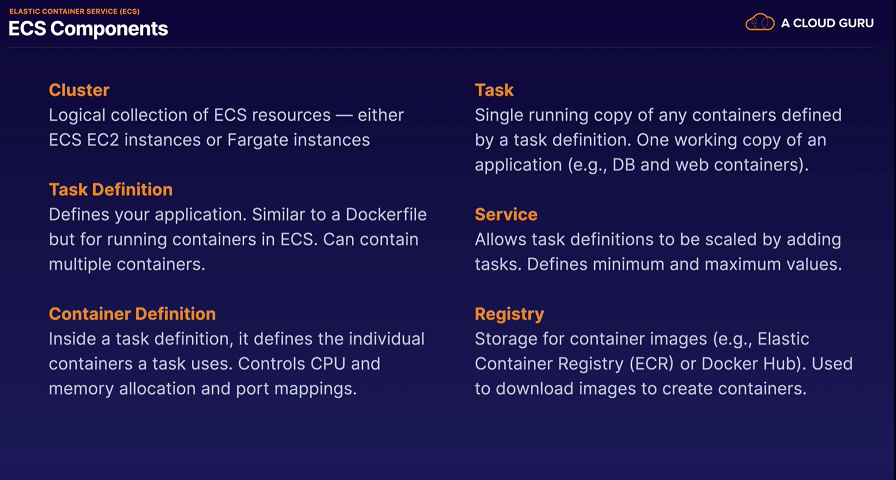

Links:   

https://aws.amazon.com/de/blogs/architecture/understanding-the-different-ways-to-invoke-lambda-functions/   

In SERVERLESS you only care about your code. You put your code into the cloud.  
You pay for the execution-time.  

### Lambda

Lambda is the ultimate Abstraction Layer:
- Data Centres
- Hardware
- Assembnly Code/Protocols
- High Level Languagees
- Operating Systems
- Application Layer/AWS APIs
- AWS Lambda (--> lambda handle all of these things above)

### What is Lambda?
AWS Lambda is a compute service where you can upload your code and create a Lambda function.  
AWS Lambda takes care of provisioning and __managing the servers__ that you use to run the code.   
You dont have to worry about operating systems, patching, scaling, etc. 

__You can use Lambda in the following wways:__   

- As an event-driven compute service where AWS Lambda runs your code in response to events. These events could be changes to data in an Amazon S3 bucket or an Amazon DynamoDB table.

- As a compute service to run your code in response to __HTTP requests__ using Amazon API Gateway or API calls made using AWS SDKs. Thius is what wee use at A Cloud guru.

In the Lambda and Serverless approach, we will always have an api-gateway in the front (8:43 Minute)   

__What  languages does lambda support__   
- Node.js
- Java
- Python
- C#
- GO
- PowerShell

__How is lambda priced__   
- Number of requests     
First 1 million requests are free. $0,20 per 1 million request thereafter.

- Duration    
Duration is calculated from the time your code begins executing until it returns or otherwise terminates, rounded up to the nearest 100ms. The price depends on the amount of memoiry you allocate to your function. You are charged $0.00001667 for every GB-second used.

__Why is Lambda Cool?__   
- no servers
- continuius scaling
- super super cheap

__Lamda in action__   
used with amazon echo

__Exam Tips__   
- Lambda scales out (not up) automatically
- Lambda functions are independent, 1 event = 1 function 
- Lambda is serverless
- Know what services are serverless!
- Lambda functions can trigger other lambda functions, 1 event can = x functions if functions trigger other functions

- Architectures can get extremly complicated, AWS X-Ray allows you to debug what is happening
- Lambda can dot things globally, you can use it to back up S3 buckets to other S3 buckets etc
- know your triggers (what can trigger lambda . for example rds cannot trigger lambda yet)

### SAM (Serverless Application Model)

INFO: CloudFormation is was ähnliches wie Terraform nur von AWS   

- CloudFormation extension optimized for serverless applications
- New types: functions, APIs, tables
- Supports anything CloudFormation supports
- run serverless applications locally
- package and deploy using CodeDeploy

### Elastic Container Service (ECS)

__What is ECS?__  
- Managed container orchestration service
- Create clusters to manage fleets of container deployments
- EC2 manages EC2 or Fargate instances
- Schedules containers for optimal placement
- Defines rules for CPU and memory requirements
- Monitors resource utilization
- Deploy, update, roll back containers 
- FREE... for real 
- VPC, security groups, EBS volumes
- ELB
- CloudTrail and CloudWatch

__Fargate__   
- Serverless container engine
- Eliminates need to provision and manage servers
- Specify and pay for resources per application
- Works with both ECS and EKS
- Isolation and security
- Choose EC2 instead if:
  - Compliance requirements
  - Require broader customization
  - Require GPUs

__EKS__   
- Elastic Kubernetes Service
- K8 is open-source software that lets you deploy and manage containerized appolications at scale 
- same toolset on-premises and in cloud 
- Containers are grouped in __pods__
- Like ECS, supports both EC2 and Fargate
- Why use EKS?
  - Already using K8s
  - Want to migrate to AWS

__ECR__  
- Managed Docker container registry
- Store, manage and deploy images
- Integrated with ECS and EKS
- Works with on-premises deployments 
- Highly available
- Integrated with IAM
- Pay for storage and data transfer

