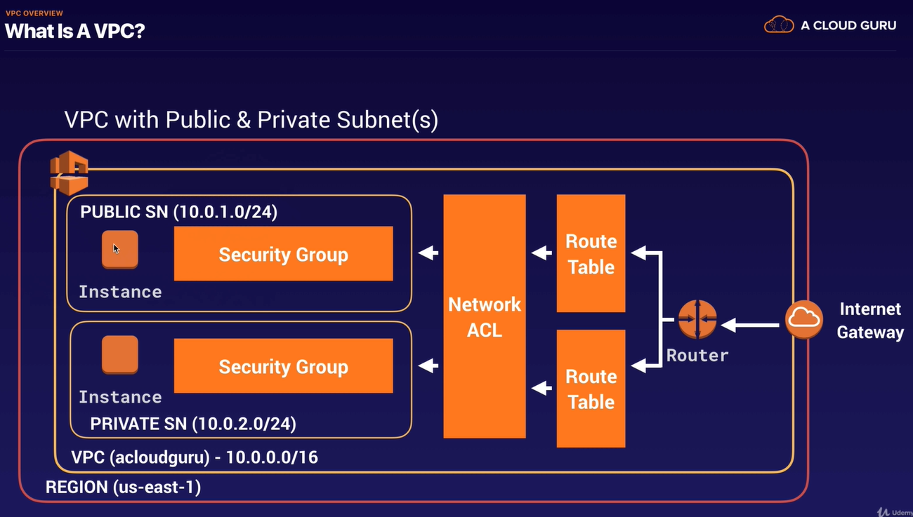
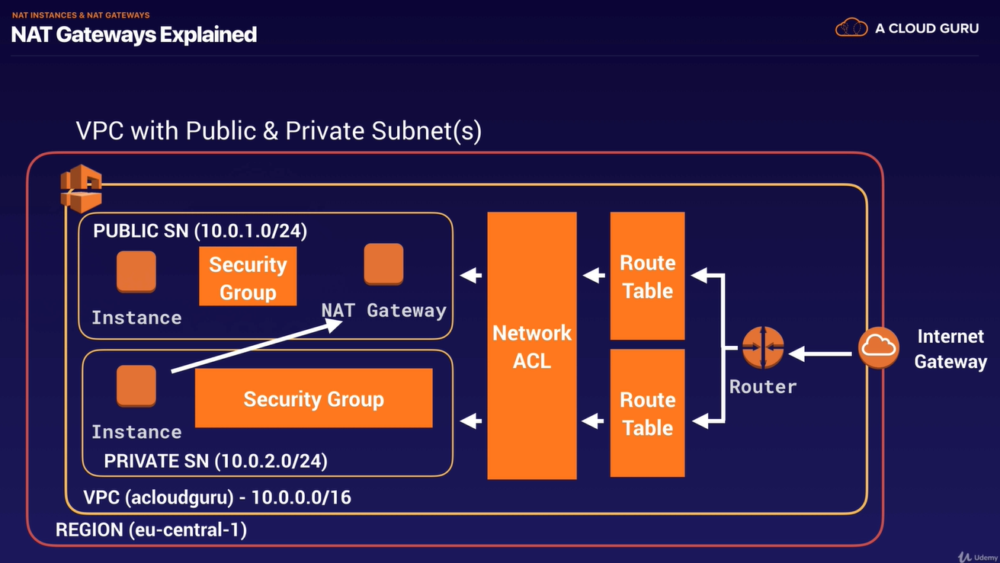
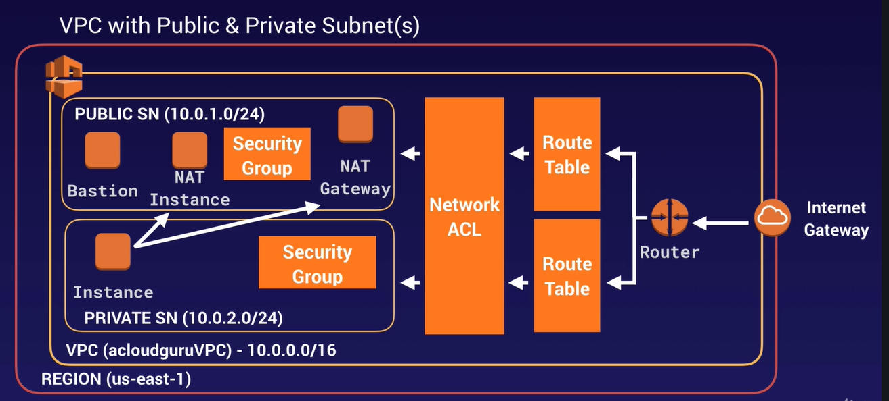

# VPC

__What is a VPC__
- virtual data centre in the cloud

there ou can select your won IP address range   
create subnets   
configuration of route tables and network gateways   

IP/SUbnat:   
https://cidr.xyz/

A route table contains a set of rules, called routes, that are used to determine where network traffic from your subnet or gateway is directed.    
(Quelle: https://docs.aws.amazon.com/vpc/latest/userguide/VPC_Route_Tables.html)   

__VPC Feature__   
- Launch instances into a subnet of your choosing
- Assign custom IP address ranges in each subnet
- Configure route tables between subnets
- Create internet gateway and attach it to our VPC
- Much better security control over your AWS resources
- INstance security groups
- Subnet network accesss control lists (ACLS)

__Default VPC VS Custom VPC__   

- Default VPC is user friendly, allowing you to immediately deploy instances
- All Subnets in default VPC have a route out to the internet
- Each EC2 instance has both a publiuc and private IP address

__VPC Peering__ 
- Allows you to connect one VPC with another via a direct network route using private IP addresses
- Instances behave as if they were on the same private network
- You can peer VPOCs with other AWS accounts as well as with other VPCs in the same account
- Peering is in a star configuration: ie 1 central VPC peers with 4 others.
  NO TRANSITIVE PEERING.

### Video 87 / 88 - Build a custom vpc part 1 / 2

Im part 1 baut man den öffentlichen teil   
In VIdeo 88 verbindet man den öffentlichen teil mit dem privaten und lässt diese miteinander kommunizieren.    

   

- we have a private and a public route table
- 

### Video 89. Network Address Translation (NAT)   

NAT  = Network Address Translation   

we get here, becuase we was not able to get updates for our private-network. we want to install updates and software.   
-> so we want to enable our ec2 instances in our private subnet to still be able to go out and to download software   

  

__NAT-Instance__ VS __NAT Gateway__   

- first we do it with a __NAT-Instance__  
⚠️⚠️⚠️⚠️⚠️⚠️⚠️you dont want to use nat-instances in real world⚠️⚠️⚠️⚠️⚠️⚠️

das Problem bei der Lösung ist, dass dies eine eigene Instanz ist. Möchten nun tausende Computer aus dem privaten Bereich ins Internet, kann dies schnell überlasten.   

- second: __NAT Gateway__   

⚠️⚠️⚠️⚠️Man hat entweder ein nat gateway ODER nat instance⚠️⚠️⚠️⚠️
  

### Video 90 - Access Control Lists (ACL)

Network ACL = Network Access Control List   

A new ACL deny everything: all Inboud an Outbound traffic   

__Ephemeral port__   

https://en.wikipedia.org/wiki/Ephemeral_port   

### Video 91 Custom VPCs nd ELBs

ELB = Elasitc Load Balancers   

⚠️⚠️⚠️⚠️EXAM TIP⚠️⚠️⚠️⚠️⚠️
!!!when you provision a load balancer you need at least two public subnets!!!!   

### Video 92. VPC Flow Logs

### Video 93. Bastions

A Bastion is used to securely administer EC2 instances (Using SSH or RDP). Bastions are called Jump Boxes in Australia  
Von außen auf EC2-Instanz im privaten Netz über ssh RDP zugreifen.   

Der vollständigkeit auch DMZ angucken.   

### Video 94 - Direct Connect

- Direct Connect directyl connects your data conter to AWS

### Video 95 - Setting Up a VPN over a direct Connect Connection

### Video 96 - Global Accelerator

### Video 97 - VPC End Points

### Video 98 - VPC Private Link

