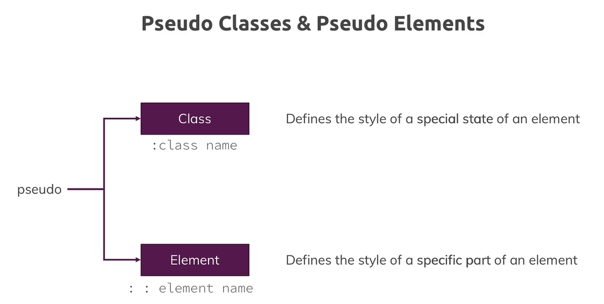
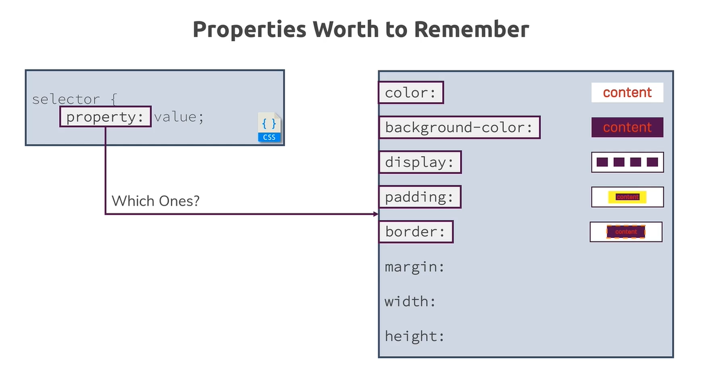
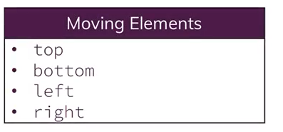

# Links and Stuff
Nützliche Links, Tools etc.   

### css frameworks

## BULMA - templates
https://bulmatemplates.github.io/bulma-templates/

### css reference 
https://developer.mozilla.org/de/docs/Web/CSS/CSS_Referenz   

### google fonts 
udemy course: Video 16    
https://fonts.google.com/


# selectors
Um CSS für Elemente oder Element-Gruppen zu definieren gibt es unterschiedliche Möglichkeiten   
die im folgendem vorgestellt werden:   

__BEACHTE:__    
Learn CSS #2: The difference between ID and Class Selectors    
https://www.youtube.com/watch?v=B1URDgh_DIo    

## class-selector
udemy - video 17    
we can add classes to elements in the html.    
with that we can determine css for that class.  
can be used multiple times. (ID selector not)   
HTML:    
`<h1 class="blog-post"></h1>`    
`<h1 class="blog-entry"></h1>`

CSS:   
the decleration of a class starts with a dot.    
`.blog-post {`   
	`color: red;`   
`}`   


## ID-selector
udemy - video 17  
Set style to one specific element. __to just one__.    
in fact you can use the id selector multiple times, but you shouldnt.    

HTML:    
`<h1 id="main-title">Out header</h1>`    
CSS:     
mit Raute definiert:    
`#main.title {`    
	`color:red;`    
`}`    

##tag/element-selector
Bezieht sich auf __alle__ tags (hier h1) im html
HTML:    
`<h1>Get the freedom you deserve.</h1>`    

CSS:   
`h1 {`    
    `color: white;`   
    `font-family: 'Anton', sans-serif;`   
`}`   

## Attribute-Selector
udemy - video 17   
Set equal styles to all elements with attribute(s)   

das Beispiel bezieht sich auf das Attribut 'disabled'   
HTML:    
`<button disabled>`    
`CLICK`    
`</button>`    

CSS:   
`[disabled] {`   
`color: red;`   
`}`   

## Priority of selectors
__The priority is called specifficity__   

(Quelle: Udemy - CSS-Video - 18. Understanding the "Cascading" Style & Specificity)   
__Video 18 ist ein wichtiges Grundlagen-Video!__   

Es gibt eine Hierarchie welche Selektoren welche überschreiben.   
Wurde z.b. eine Farbe in einer tag-Selektor definiert, wird dies durch ein class-selektor überschrieben.   

Gleiche Selektoren überschreiben sich. __Dabei gewinnt der weiter unten definierte.__ Die importierte CSS-Datei wird von oben nach unten geparsed.   
Die Rheienfolge hat nur bei gleichen Selektoren eine Auswirkung.   

__Cascading__    
Bedeutet, wie im Bild angegeben, dass mehrere Regeln einem Element zugeordnet werden können.    


# Vererbung

__TODO !!!__

# kombinator

`#product-overview h1`    
alle h1 tags innerhalb der klasse/ID-Selector   


### different types of compinators:   
Erläuterung zu Combinators:


### Adjacent Sibling
Erläuterung zu Adjacent Sibling:


### General Sibling
Erläuterung zu Adjacent General Sibling:


### Child
Erläuterung zu child:


# The Box-Model

The dash in the margin, border and padding-section means that no values are set for them.   
Every element has these layers:   

Note: Border is for example the table-border!


The blue box is the content.   
These layers: the content, padding, border and margin - Every element is interpreted as such a box in css.   

## Boxmodel and the width
__SEHR WICHTIG__  
https://developer.mozilla.org/de/docs/Web/CSS/box-sizing  
entsprechendes Video auf Udemy:  
https://www.udemy.com/course/css-the-complete-guide-incl-flexbox-grid-sass/learn/lecture/9466116#overview   

deswegen wird dies mit dem [Universalselektor](https://developer.mozilla.org/de/docs/Web/CSS/Universal_selectors) gesetzt:
```css
* {
    box-sizing: border-box;
}
```

## Margin Collapsing
Die Margins von zwei Elementen überlappen sich:   


# shorthand properties
Video 30 udemy   


infos für das border beispiel: die reihenfolge nach dem doppelpunkt ist egal. solange die Werte sich nicht mit anderen überscheiden.   

__margin info__   
tha last `margin: 10px` bedeutet, das an allen Seiten der gleiche margin gesetzt wird.    

## shorthand dev-übersicht
(Video 30)   
wir haben gelernt, dass `margin` ein shorthand ist.   
wenn man dieses an einen Element vergeben hat und man möchte in der dev-Ansicht dieses inspecten, muss man auf   
das Pfeil neben `margin` klicken. Dann bekommt man eine Auflistung, was es ausgeschrieben bedeutet.   


# block level-Elements vs inline-Elements

## block level elements nehemen eine ganze zeile ein
block level elements nehmen immer den ganzen Platz ein.   
 
## inline Elemente
inline elements sind innerhalb eines block level elements.   
fügt man zwei inline elemente hintereinander (oder unten in zwei Reihen) im html-code, so werden sie auch in einer reihe angezeigt.   
`<a href = xxxx>`   
`<a href = xxx>`   
diese beiden Elemente würden in einer Reihe angezeigt werden

further information:   
https://developer.mozilla.org/de/docs/Web/HTML/Block-level_elemente   

# display: none vs visibility: hidden
[quelle](https://www.udemy.com/course/css-the-complete-guide-incl-flexbox-grid-sass/learn/lecture/9464806#questions)
### display: 
none this value removes the element to which you apply it from the document flow. This means that the element is not visible and it also doesn't "block its position". Other elements can (and will) take its place instead.


### visibility: hidden
If you only want to hide an element but you want to keep its place (i.e. other elements don't fill the empty spot), you can use visibility: hidden; 


# the display property
we can change the behavior of an inline-Element to an block-element.   
for example we can change the display-property of an a-tag (that is an inline-element) to a block element.   
`<a href="customers/index.html" style="display: block">Customers</a>`   

## display: inline-block
macht beides. Es macht das element __inline__: es wird hintereinander angezeigt.    
but they still have a box, where we can set an padding and so on.   

-> demnach kann man sonst inline-Elementen kein padding usw geben?!   


Compared to display: inline, the major difference is that display: inline-block allows to set a width and height on the element.  
Also, with display: inline-block, the top and bottom margins/paddings are respected, but with display: inline they are not.  
Compared to display: block, the major difference is that display: inline-block does not add a line-break after the element, so the element can sit next to other elements.  
[quelle](https://www.w3schools.com/css/css_inline-block.asp#:~:text=CSS%20Layout%20%2D%20display%3A%20inline%2Dblock&text=Compared%20to%20display%3A%20inline%20%2C%20the,display%3A%20inline%20they%20are%20not.)


further information:   
https://academind.com/learn/html/beginner-s-guide/diving-deeper-into-html/#block-level-vs-inline-elements   
https://www.mediaevent.de/css/position-display.html   

# Pseudo Classes & Pseudo Elements




# Grouping

wenn der code für hover und active gleich ist, kann man diese duch einen Komme trennen.   
So spart man sich code.   

`.main-nav__item a:hover,`   
`.main-nav__item a:active {`   
    `color: white;`   
`}`   

# Properties Worth to Remember




# Advanced Attribute Selectors


Bsp.:   
.signup-form input[type="checkbox"]   

in der Klasse signup-form werden alle input-tags vom type 'checkbox' angesprochen    
(Video 166)


# Abschnitt 6: Positioning Elements with CSS-Datei

`top: 100px;`   
kann nur gesetzt werden, wenn es nicht das default-Verhalten (static) ist. 

## The "position Property"





# z-Index (Video 86)
Über den Z-Index kann man steuern ob ein Element über ein anderes liegt oder nicht.   
Mann kann es also in den Vorder- oder Hintergund bringen.   

Der Default-Wert vom Z-Index ist 0 bzw/oder "auto".    
Ein Z-Index kleiner 0 Positioniert das Element hinter die anderen.   
Ein Wert größer 0 Positioniert es über die Elemente.


Man kann Elementen unterschiedliche Werte geben und damit Ebenen definieren.   
Somit kann man bestimmten, welche Elemente auf welcher Ebene stehen.    
Also welches Element über ein anderes steht.   
-> siehe dazu Video: "92. Understanding the Stacking Context"    


# SASS / SCSS

https://sass-lang.com/  
https://sass-lang.com/install  

Syntactically Awsome Style Sheets  

a __scss file__ is compiled into __css__  

#### SASS VS SCSS
__SASS__ hat eine andere Syntax als css. Es hat keine Semikolons und keine Kalmmern  

__SCSS__ hat die gleiche Syntax wie css. Eine css datei kann so in eine .scss Datei kopiert werden.  


### Funktionalität: Variablen definieren
Wird ein Wert oft in einer css-Datei genutzt, kann man diesen in eine Variable packen 
Z.B. einen Farb Hex-Wert 

```
ganz oben im csv-file definieren:
$main-color: #521751;
```
anschlißend benutzen:  
```
border: 0.05rem solid $main-color;
```
wenn das alles nach css kompiliert wird, wird der wert überall entsprechend ersetzt. 

genau so kann man mehrere Werte auslagern:

``` css
$border-default: 0.05rem solid $main-color;

und es benutzen:

.sass-introduction {
	border: $border-default;
}

```

### maps definieren__  
map of color. Im Sinne der struktur und Gruppierung:  
Eine map colors mit zwei Keys `main` und `secondary` und entsprechenden Werten. 
```
$colors: (main: #521751; secondary: #fa923f;);
```
und benutzen:  
```
map-get($colors, main)
```
map-get ist eine function. man übergibt die map und den key, den man aus der map lesen möchte.  

### Arithmetic
man kann Berechnungen benutzen:  
aus  
```css
$size-default: 1rem;
padding: $size-default * 3 0;
```
wird im css file anschließend:  
```css
padding: 3rem 0;
```


### Inheritance
Es ist möglich von Klassen zu erben. Dann nur bestimmte Properties in den abgeleiteten Klassen zu ändern:
```
.sass-section {
	...code...
	...code...
	...code...
}

.sass-introduction {
	@extend .sass-section
	box-shadow: ....code ... 
}

```

### Mixins

damit kann man den textblock einen namen geben und überall einfügen.  
textblock tefinieren:  
```
@mixin display-flex() {
	display: -webkit-box;
	display: -ms-felxbox;
	display: -webkit-flex;
	display: flex;
}
```
beachte: `mixin` ist kein css begriff

und nutzen:
```
.container {
	@include display-flex();
}
```
es können auch Parameter übergeben werden.   


