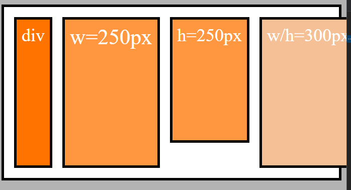

# flexbox

- The Flex-Container

- Main Axis vs. Cross Axis

- Flex Items

## Understanding Flexbox
to use flexbox:  
`display: flex;`  
or  
`display: inline-flex;`  
but in general we want the first one.  

```
.flex-container {
    background: white;
    padding: 10px;
    border: 5px solid black;
	height: 1300px;
	display: flex;
	flex-direction: row;
	flex-wrap: wrap;
	align-items: center;
	justify-content: center;
	
	align-content: center;
}
```

with that we create a "flex container" or "parent".  
The container has elements - The so called "children" or "Flex Items".  


### flex-direction / flex wrap
animiert:  
https://developer.mozilla.org/en-US/docs/Web/CSS/flex-direction

## flex-wrap
- `flex-wrap`  
values: `nowrap`, `wrap`, `wrap-reverse`  
default-property is `nowrap` : `flex-wrap: nowrap;`  

- ausgangssituation wrap (volle Ansicht)


- wrap example (Fenster wurde verkleinert):


- nowrap example:  



## flex-direction
- `flex-direction` 
values: `row`, `column`, `column-reverse`  
default-property is `row` : `flex-direction: row;`  


- flex-direction column


#### flex-wrap und flex-direction zusammen definieren
Beides kann auch in einer Zeile definiert werden:  
`flex-flow: row wrap`

### Understanding the Importance of Main Axis & Cross Axis
weitere Infos: https://developer.mozilla.org/de/docs/Web/CSS/CSS_Flexible_Box_Layout/Basic_Concepts_of_Flexbox


bezieht sich auf `flex-direction`

https://www.udemy.com/course/css-the-complete-guide-incl-flexbox-grid-sass/learn/lecture/9654224#overview


- Erklärung oben links:  
bei `flex-direction: row;` fangen die "Kacheln" OBEN LINKS an. Jede weitere wird neben der anderen entlang der Main-Axis gelegt.   
Hat man kein Platz, wächst es nach unten (cross) weiter.

- Erklärung oben rechts:  
bei `flex-direction: row-reverse;` fangen die Kacheln oben rechts an. Jede weitere wird neben der anderen entlang der Main-Axis gelegt.  
Hat man kein Platz, wächst es nach unten (cross) weiter.  


## Working with "align-items" & "justify-content"
https://www.udemy.com/course/css-the-complete-guide-incl-flexbox-grid-sass/learn/lecture/9654226#overview

Bitte Bild weiter unten beachten.

### align-items
alignment within the __cross-axis__ because of `align-items`
- values: `strech`, `center`, `flex-end`

- default is strech:  
`align-items: stretch;`  

### justify-content
alignment within the __main-axis__ because of `justify-content`  

- values: `center`  
`justify-content: center;`  


## align content

`align-content: center;`
