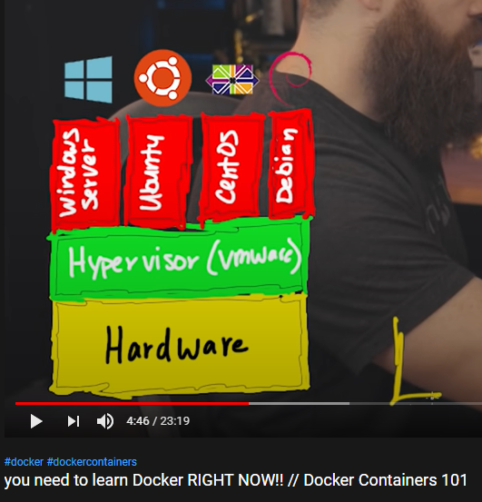
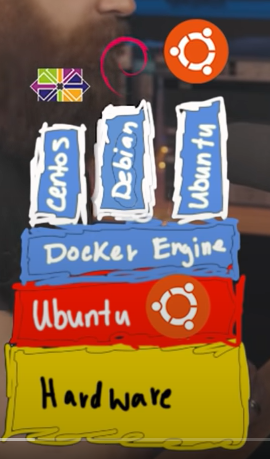

# Links

- Was ist Orchestrierung?    
https://www.datacenter-insider.de/was-ist-orchestrierung-a-683610/

- TEIL1: Die Docker-Entstehung und -Einsatzgebiete    
https://www.datacenter-insider.de/die-docker-entstehung-und-einsatzgebiete-a-750402/

# Commands 
`exec`   
Run a command in a running container

# Commands for docker compose
`docker-compose up ldap`

## image vs container
Images can exist without containers, whereas a container needs to run an image to exist.     
https://phoenixnap.com/kb/docker-image-vs-container    
https://www.datacenter-insider.de/images-und-container-in-docker-a-759636/    

## brauch ein container immer ein betriebssystem
Wenn man ein Dockerimage für einen Server (z.b apache) hat,  kann man dieses Image auf den container packen, ohne vorher ein betriebssystem drauf zu packen:    
https://iximiuz.com/en/posts/not-every-container-has-an-operating-system-inside/

# Docker

### Docker replace Virtual Mashines    

#### Virtual Mashine:     
Teilt einen Server, auf den man ein Betriebssystem installieren konnte, in mehrere Betriebssysteme.    
Ermöglicht mehrere Betriebssysteme auf einem Server.    
Eine Mögliche Umsetzung: VMWare    

Hier wird __Hardware__ virtualisiert.

#### Docker:    
Man installiert erneut ein einziges Betriebssystem auf dem Server.    

Virtualisiert das __BETRIEBSSYSTEM__

Die Images können als "Micro-Computer" angesehen werden.
Bei Docker brauchen die einzelnen Container kein eigenes Betriebssystem.    
Und sie sind __ISOLIERT__ - demnach sicher vor anderen Zugriffen

