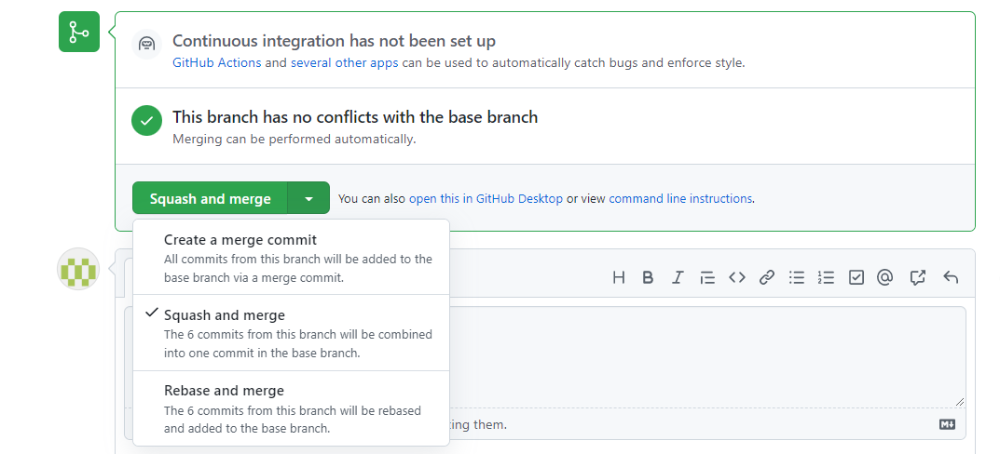

# Git hooks
https://kiwidamien.github.io/prevent-big-commits.html

## Commit Signature
https://docs.github.com/en/authentication/managing-commit-signature-verification/about-commit-signature-verification#gpg-commit-signature-verification

Bei der GPG-Key Erstellung die richtige E-Mail eintragen, die auch in github eingetragen ist. Falls es eine neue E-Mail ist, diese unter den Settings hinzufügen.   

festlegen, dass jeder commit verifiziert werden soll `git config commit.gpgsign true`   
macht man das nicht, muss man dies bei jedem commit angeben: `git commit -S -m "your commit message"`   

# GIT


WORKSPACE	->	STAGE/INDEX-BEREICH	->	LOCAL REPOSITORY	-> 	remote REPOSITORY
               add		              commit				push

										<-
										fetch	


## HEAD
Woher weiß Git, welchen Branch Du momentan verwendest? Dafür gibt es einen speziellen Zeiger mit dem Namen HEAD.
Der HEAD-Zeiger schreitet mit jedem weiteren Commit voran.
-> hat man mehrere Branches, zeigt HEAD den an, auf dem man aktuell arbeitets
(https://git-scm.com/book/de/v1/Git-Branching-Was-ist-ein-Branch%3F)


## What is “origin” in Git? (https://stackoverflow.com/questions/9529497/what-is-origin-in-git)
origin is an alias on your system for a particular remote repository.
Remotes are simply an alias that store the URL of repositories. 
You can see what URL belongs to each remote by using:

```
git remote -v
origin  https://marko_k@bitbucket.org/marko_k/erste-schritte.git (fetch)
origin  https://marko_k@bitbucket.org/marko_k/erste-schritte.git (push)
```


## set git username and email
`git config --global user.name marko.k`     
`git config --global user.email marko@emil.de`    

## git worktree
Da wir nun stärker mit Branches arbeiten möchte ich euch auf ein Git Feature aufmerksam machen, das einen Wechsel zu anderen Branches erleichtert (beispielsweise für spontane Reviews oder Hotfixes), ohne den lokalen Zustand ändern zu müssen: git worktree erlaubt das Erstellen einer vollwertigen Kopie des aktuellen Repos, mehr oder weniger mit dem gleichen Effekt wie git clone.
 
Mehr Details dazu findet ihr in https://git-scm.com/docs/git-worktree und einen leichter konsumierbaren Artikel unter https://opensource.com/article/21/4/git-worktree.

## Fast Forward
Beispiel:   
https://git-scm.com/book/de/v2/Git-Branching-Einfaches-Branching-und-Merging

## Grafische Oberfläche starten:
gitk

## Git History in Oberfläche anzeigen
`git log --pretty=format:"%h %s" --graph --oneline`    
quelle: https://git-scm.com/book/de/v2/Git-Grundlagen-Anzeigen-der-Commit-Historie        
    

## Erstes Klonen
git clone https://github.com/markohr/tutorials.git

	
## COMMIT
`git commit -am "BugID: 1111 TextText"`   
führt ein commit durch 

__ablauf - Vermeidung von merge-commits beim commit__:   
- man pullt um sauber zu sein
- man added die dateien, die commited werden sollen
- man commited die Änderungen und vergibt eine message
- in der Zwischenzeit könnten commits von anderen Benutzern durchgeführt werden - und jetzt will man diese vorher holen:
- `git pull --rebase`
- damit vermeidet man ein merge-commit

## Commit Message ändern
`git commit --amend`    
möchte man die commit-message vom letzten commit ändern, der noch nicht gepushed ist  
weitere nützliche infos zu commit-message-Änderungen: https://gist.github.com/nepsilon/156387acf9e1e72d48fa35c4fabef0b4#file-git-change-commit-messages-md     

## PULL
`git pull`	
a special case: it combines fetch and either a merge or a rebase - depending on how you've got git configured    

## pull request
options, when you want to merge a pull request into the branch:    



## reset
```
git reset --hard HEAD   
git reset bla.txt HEAD	#Änderung der Datei bla.txt aus dem Stage-Bereich entfernen / im workspace bleibt sie erhalten
```


# Vorgehen Feature-Branch in master mergen
Anmerkung von Stepan:   
## Stepan on branch to master
"also bitte rebasen den branch auf master und den master nicht in den branch mergen"   
"vorallendingen letzteres ist ätzend."


1. auf den feature-branch
2. auf feature-branch: `git rebase master`
hier werden alle Änderungen in den Branch geholt. Die vorhandenen Änderungen auf dem branch werden hinter die commits im master gepackt.   
Hier kann es zu konflikten kommen.   
diese Aktion pushen wird nicht auf den Feature-Branch.   
-> würde ich dieses hier commiten und ich arbeite mit einem andern auf diesem Branch, könnte der andere den branch nicht mehr pullen, weil wir die history durcheinandergebracht/verändert haben   
diesen schritt hier macht man nur, wenn man final in den master mergen möchte   
3. jetzt wechselt man in den master und holt den branch hier rein
`git merge PLA-10770_argon2PasswordHash --squash`


## squash info
https://www.youtube.com/watch?v=V5KrD7CmO4o


## MERGE
1) auf den master branch gehen (bzw auf den branch, in den die Änderungen eines anderen Branches geholt werden sollen)      
2) git merge --squash eurodataSettingRebuild   
-> hierbei werden alle Änderungen aus dem branch "eurodataSettingRebuild" in den master geholt.   
3) konflikte lösen. sind die konflikte gelöst, die Datei mit "git add" 'bereinigen'   
4) push + commit   
!!!Wegen dem "--squash"-command werden die Änderungen, die auf dem Branch durchgeführt wurden als EIN commit geadded.
Die einzelnen commits auf dem branch gehen demnach verloren -> es bleibt nur das endgültige ergebnis, der letzte Stand

## REBASE
In den branch gehen, in dem man die Änderungen von dem anderen Branch holen möchte:   
- active branch is feature-branch.    
`git rebase master`   

rebasing abbrechen (falls ggf. Konflikte aufgetreten sind)   
`git rebase --abort`


## detached HEAD
https://www.git-tower.com/learn/git/faq/detached-head-when-checkout-commit    

## LOG
`git log -3`   
nur die letzten 3 commits anzeigen

`git log --oneline` 
nur eine zeile je commit

`git log --stat`   
nur statistiken anzeigen

`git log origin/master..HEAD`   	
zeigt commits, die aber noch nicht gepushed wurden

## DIFF
`git diff`  

workspace vs stage
`git diff --staged`  

stage vs. repository


## BRANCH COMMANDS
`git remote show origin`  :information_source:    
zeigt alle __remote__ und __lokal__ branches an und auch die verlinkungen der remote und local-branches.


`git branch`   
zeigt alle lokalen branches

`git branch -r`   
zeigt alle remote-branches an. Mögliche anzeige:   
*origin/classes*   
*origin/createoffer*   
*origin/experimental/bundle*   

__einen bestehenden Branch auschecken__

möchte man nun einen remote branch auschecken *UND* lokal eine kopie vom ihm erhalten:   
`git checkout createoffer`   
man beachte, dass man origin weglässt.   

wo hingegen:   
`git checkout origin/createoffer`    
einen detached head erzeugt. es holt den stand von dem branch ohne ihn auszuchecken.    
man kann aber den State vom branch sehen.   

__master and origin/master__    
Man unterscheidet immer zwischen lokalen branches (master) und remote branches (origin/master)    
-> https://stackoverflow.com/questions/18137175/in-git-what-is-the-difference-between-origin-master-vs-origin-master   


__lokal einen neuen branch erzeugen und anschließend pushen (Schritte 1-2)__  
	
1) `git checkout -b <newBranch>` 
Einen neuen Branch erzeugen und gleichzeitig dorthin wechseln.  
Keep in mind that this branch is only local to the developers machine and is not on the central repository.   
Das ist die Kurzform der beiden folgenden Befehle:   
$ git branch iss53  
$ git checkout iss53  
(quele: https://git-scm.com/book/de/v2/Git-Branching-Einfaches-Branching-und-Merging)

2) `git push -u origin <newBranch>`   
schiebt den lokalen branch auf remote
origin ist ein alias auf (https://git_*****/platform)

__branch remote löschen__   
`git push origin --delete <branchname>`  
löscht den branch auf remote (origin) / der branchname muss nicht "origin/" enthalten

__branch lokal löschen__   
`git branch -d <branchname>`   
lösche lokal einen vorher ausgecheckten branch.   

## Revert 
Ausganssituation: ein commit wurde gepusht und ist auf origin.    
Ziel: man möchte die Änderungen rückgängig machen.    

- Variante 1: revert

`git log -3`    
zeigt die 3 letzen commits, dort den hash des commits in Erfahung bringen, den man rückgängig machen möchte
			
`git revert efd16ca28693cb3ec7423cbb74aef4eddb904313`   
Macht den commit mit dem angegebenen hash rückgängig.  
Nach dem Ausführen öffnet sich ein Editor für die commit-message  

## GIT STASH 
- git stash
- git stash pop

- git stash list   
- git stash pop stash@{0}


https://www.atlassian.com/git/tutorials/merging-vs-rebasing   
   
GOLDEN RULE OF REBASING   
https://www.atlassian.com/git/tutorials/merging-vs-rebasing#the-golden-rule-of-rebasing

git rebase origin/master

## GIT CHERRYPICK

`git cherry-pick 185ea33`  
vorher in den branch wechseln, in dem man die Änderung übernehmen möchte  
die Zahl ist der commit-hash

## commits zählen
`git shortlog -s -n`   
   
quelle:
http://de.gitready.com/intermediate/2009/01/22/count-your-commits.html

## find last added files of an user/commiter

`git log --author stepan.r --pretty="%h %s" --name-status --diff-filter=A`   
findet alle added-fiels von einem user (stepan.r)   
   
## Zeige alle commits von einem user wann (Zeit) er wann was eingecheckt hat
git log -100 --pretty="%h %aD" --author=andreas.k


## git mergetool  
um konflikte und diffs besser anzuzeigen   
Befehl: git mergetool   
   
der Befehl muss vorher konfiguriert werden. Es muss separat ein Programm installiert werden.

https://sourcegear.com/diffmerge/downloaded.php

## GIT CONFIG ANZEIGEN 
git config --list //es gibt ein global/system/local File (unterschied? Welcher wird wann gezogen?)


## infosites:
- info zu push und pull   
http://de.gitready.com/beginner/2009/01/21/pushing-and-pulling.html
   
- Erklärungen   
http://think-like-a-git.net/   
http://www-cs-students.stanford.edu/~blynn/gitmagic/   
https://github.com/pluralsight/git-internals-pdf/releases   
  
- git and patches:   
https://stackoverflow.com/questions/8279602/what-is-a-patch-in-git-version-control
