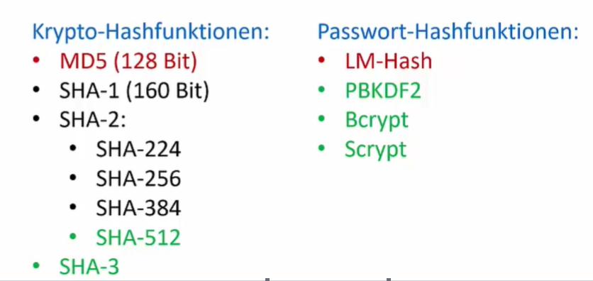
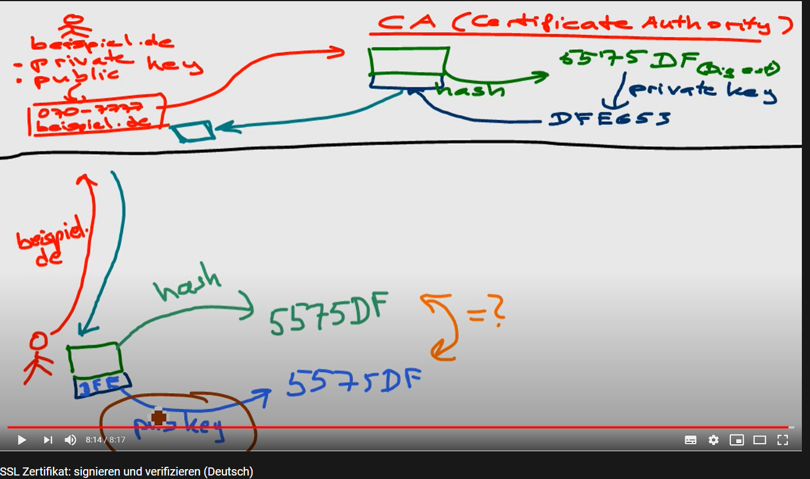

### TODO
- SSL/TLS (SecureSocketLayer - Über TCP angesiedelt)
- SSH (keys, die man für den login in github benötigt)
- GPG (zum signieren von commits in github)
- PGP (PrettyGoodPrivacy)

# Digital Certificates Explained
https://sites.google.com/site/amitsciscozone/home/security/digital-certificates-explained

# Hashfunktion
Berechnet aus Eingabe m variabler Länge eine Zeichenkette H(m) gester Länge

# digitale signatur / signature / java
https://www.baeldung.com/java-digital-signature

#X.509
https://de.wikipedia.org/wiki/X.509

# Hashalgorithmen

MD-5   
SHA-1   
SHA-2   

# Authentifizierung
Das die Nachricht von dem Stammt, von dem man denkt das sie kommt
durch: digitale unterschrift

# Nachrichten-Integrität
Nachricht icht geändert/modifiziert
durch: digitale Unterschrift

# Vertraulichkeit
Nachricht kann nur von gewünschten Empfängern gelesen werden
Durch: public/private key

Verschlüsslung

# digitale Unterschrift
Authentifizierung + Integrität

Fügt der Nachricht was hinzu, das den Absender (Unterschreiber) eindeutig kennzeichnet.    

Umgesetzt: Public- + Private Key

Vorgehen:

N = Nachricht   
K- = Private Key   
K+ = Public Key   

Bob wendet den privaten Schlüssel bei der Nachricht an: P-(N) an und schickt es mit der Nachricht N zu Alice.

Alice hat nun die Nachricht und P-(N). 
Sie will Prüfen, ob die Nachricht von Bob ist. Sie macht:
Alice nimmt P-(N) und wendet den öffentlichen Schlüssel an p+(P-(N)) und erhält N dieses vergleicht sie mit dem Originaldokument N.

Ergebnis:
Da nur mit p- Verschlüsselt werden konnte, war es Bob, der die Nachricht mit seinem privaten Schlüssel unterschrieben hat.    
Zudem kann man Integrität gewähren: die nachrichten sind gleich. Sie wurde nicht geändert.

# Zertifikat
https://www.youtube.com/watch?v=J-88MdsoTrU

Der public-key der Zertifizierungsstelle liegt bereits im Browser

# openssl

about hashing and openssl
https://opensource.com/article/19/6/cryptography-basics-openssl-part-2    

about openssl:    
https://www.zimuel.it/blog/sign-and-verify-a-file-using-openssl

### make self signed certificate

`openssl req -nodes -x509 -newkey rsa:4096 -keyout key.pem -out cert.pem -days 4000`    

-nodes (short for no DES) if you don't want to protect your private key with a passphrase    
-days expiration date    

### print cert infos

`openssl x509 -in cert.pem -text`    

### extract public key from cert.pem

`openssl x509 -pubkey -noout -in cert.pem > pubkey.pem`    

### sign a file
it generates the hash of the file and encrypt the result with the private-key.     
"Openssl can do the signing, both hashing and encrypting, in one command." (https://jumpnowtek.com/security/Code-signing-with-openssl.html)    
create large file an check the signaturefile-size

`openssl dgst -sha256 -sign <private-key> -out /tmp/sign.sha256 <file>`    
example:   
`openssl dgst -sha256 -sign key.pem -out signed_info.sha256 info.txt`    

### verify using pubkey.pem
`openssl dgst -verify pubkey.pem -signature signed_test.sha256 test.txt`    

