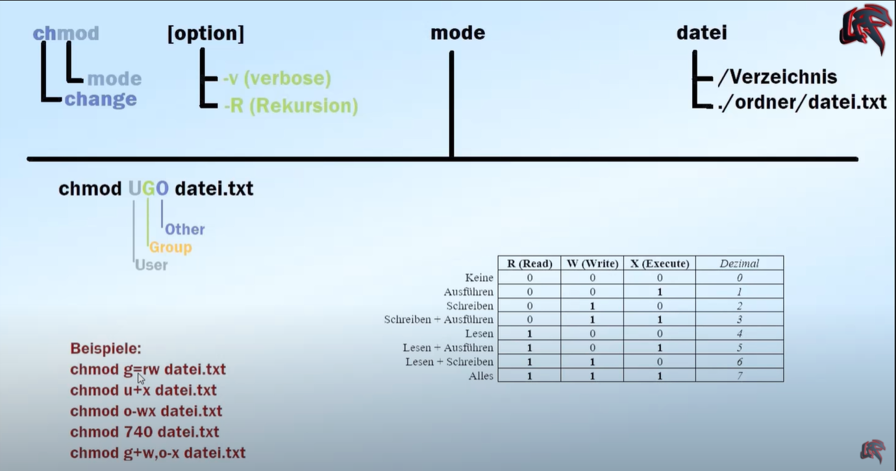
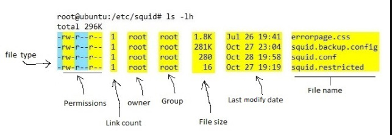

# chmod

chmod = change mode  

Kann für __Dateien__ und __Verzeichnisse__ vergeben werden.  

### source
https://www.youtube.com/watch?v=Nbepmis13sg


### Explain

Es geht um die Vergabe der folgenden Rechte:   

r = Read, w = write, x = Execute  

U = User = Inhaber  
G = Group = Gruppe  
O = Other = Andere  


  


__chmod g=rw datei.txt__  
setzt für die Gruppe(g) die Rechte read und write für die angegebene Datei datei.txt  
das Gleichheitszeichen bedeutet, dass die bisherigen Werte überschrieben werdne.  

__chmod u+x datei.txt__  
dem user wird __zusätzlich__ (__+__) das Recht zum Ausführen gegeben.  
Zusätzlich zu den Rechten die er jetzt schon hat.  Die bisherigen Rechte sind von diesem Befehl nicht betroffen.  

__chmod o-wx datei.txt__  
Der Gruppe Other wird das Recht zum Schreiben und Ausführen entnommen.  

__chmod g+w,o-x datei.txt__  
Hier werden mehrere Sachen hintereinander geschrieben.  
Die Gruppe bekommt das Schreibrecht. Alle anderen bekommen das Ausführrecht entzogen.  

__chmod 740 datei.txt__  
siehe Tabelle:  
7 = Alles  
4 = Lesen  
0 = Keine  

Entsprechend für User, Group, Other.  
User darf alles  
Group darf lesen  
Other dürfen nichts  

# check file rights
```
$ ls -lh
total 14K
-rw-r--r-- 1 marko.kovacevic 1049089 1,8K Jul 16 17:38 chmod.md
drwxr-xr-x 1 marko.kovacevic 1049089    0 Jul 16 17:37 img/
-rw-r--r-- 1 marko.kovacevic 1049089   30 Feb  7  2020 links.md
-rw-r--r-- 1 marko.kovacevic 1049089 1,5K Jul 16 16:57 linux.md
-rw-r--r-- 1 marko.kovacevic 1049089  249 Jul 16 16:57 linuxOnWindowns.md
-rw-r--r-- 1 marko.kovacevic 1049089  828 Jun 25  2020 shell_script_sieggi.md
drwxr-xr-x 1 marko.kovacevic 1049089    0 Jan 24  2020 shellSkript/
```

__Exlained__  
was bedeutet das erste Zeichen?  
`drwxr-xr-x 1 marko.kovacevic 1049089    0 Jul 16 17:37 img/`  

`d` = directory  
`-` = regular file  
INFOS: https://en.wikipedia.org/wiki/Unix_file_types  

The first character identifies the Unix File Type: A character device is marked with a c as the first letter of the mode string. Likewise, a block device is marked with a b,  

```
d : directory   
s : socket   
p : pipe   
D : Door   
l : symbolic link etc.   
```

### ls command explained
  


