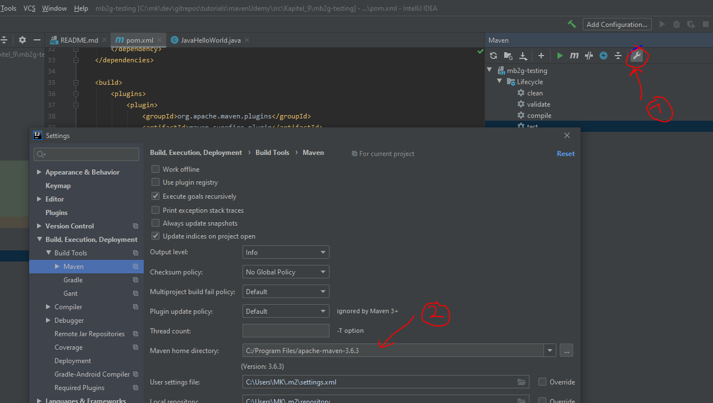

Maven Links:
Infos zu einer Version: 
- https://maven.apache.org/ref/3.6.3/   
- https://maven.apache.org/ref/

# Maven Udemy
### Kurs: Apache Maven: Beginner to Guru    

Alternative zu Maven ist Gradle    

# POM-File (POM = Project Object Model)
In der pom.xml-Datei sind die Maven-Commands. Hier wird bestimmt, was Maven machen soll.

### artifactid
The Project name

### Repositories
Maven Repositories are a location where project artifacts are stored    

- Local - Repository on local file system - <user home>/.m2/ 
  
- Central - Public repository hosted by Maven community - https://repo1.maven.org/maven2     
also: https://mvnrepository.com/ (leserfreundlichere Ansicht)

### Effective POM
Wenn man eine POM-Datei erstellt, erweitert man im Prinzip eine bestehende default POM.    
Dh man editiert nur diesen Teil, der für sein Projekt relevant ist.    
Um sich die komplette POM (effecitve POM) anzuzeigen, kann man dies so tun:    

Anzeigen unter IntelliJ: 
- rechte Maus im POM vom aktuellen Projekt    
- Im Menü "Maven auswählen"
- dort "Show Effective POM"

# Lifecycle
Ein __Lifecycle__ hat/besteht aus mehrere __Phasen__    
In den Phasen können __plugin goals__ definiert werden.
Diese Plug-Ins führen dann die eigentliche Arbeit aus.    
Man kann die Plugins auch separat aufrufen - also Ausserhalb eines Lifecycles.   

## Maven Build Lifecycle
Es gibt folgende default lifecycles: __clean__, __default__, __site__
Diese bestehen aus unterschiedlichen Phasen    

## clean Lifecycle
Der __clean__-Lifecycle besteht aus folgenden Phasen:
- pre-clean
- clean
- post-clean

## Default Lifecycle - Highlevel
Der __default__-Lifecycle hat folgende Phasen:    

- __Validate__ - Verify project is correct
- __Compile__ - Compile Source Code
- __Test__ - Test Compiled Source Code
- __Package__ - Package compiled files to packaging type
- __Verify__ - Run Integration Test
- __Install__ - Install to local Maven Repository
- __Deploy__ - Deploy to shared Maven Repository

Es existieren noch mehr Phasen. Alle Phasen nachzulesen in: MavenBuildLifeCycles.pdf

Ruft man bspw. ´mvn package´ auf, werden alle Phasen bis 'package' aufgerufen.

## aufruf unterschiedlicher lifecycle
`mvn clean install`    
clean ist aus dem __clean__-Lifecycle und install aus dem __default__-Lifecycle    
Nur install würde demnach clean nicht beinhalten.

### Welche Goals sind welchen Phasen zugeordnet?
in dieser Datei nachzulesen: executeAGoalInSpecificPhase.md

# Maven Wrapper
Lektion 5 - Video 34    
Man kann eine Wrapper mit einem Projekt ausliefern. Dannn müssen die Personen nicht mehr Maven installieren, um maven auszuführen. Das alles wird mit dem Wrapper erledigt.

# Maven Commands
Command übersicht

### mvn package
Erzeugt eine jar-Datei. Diese wird in einen target-Folder gelegt.   

### mvn clean
Löscht das target-directory

### Maven Repository
defualt: maven central

### Maven version in IntelliJ überschreiben/setzen
IntelliJ setzt/hat eine eigene Version von Maven. Diese kann so überschrieben werden:

### Maven properties in the dom file
you can set the property in the pom.xml via command line:     
`mvn -D <propertyname>`    
so you can define a property within the properties tag `<properties>`     
further infos: https://stackoverflow.com/questions/7513319/passing-command-line-arguments-from-maven-as-properties-in-pom-xml     

