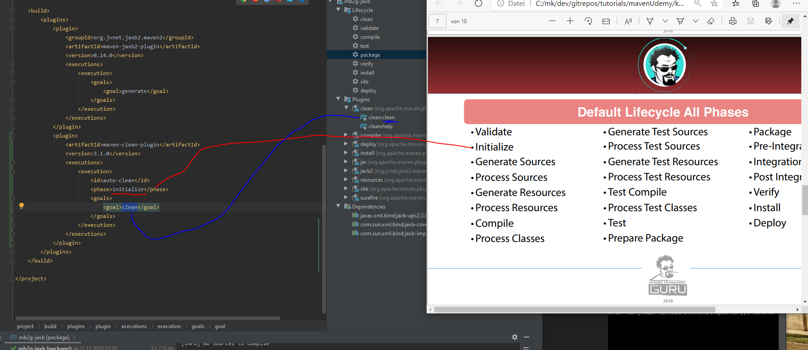

# Einen bestimmten Phase einen Plugin-Goal zuweisen

Zur Erinnerung:    
Es gibt unterschiedliche Lifecycle: clean, default, site    
Jeder Lifecycle hat gewisse Phasen.    
Diesen Phasen können unterschiedliche Plugin-Goals zugewisen werden, die dann in der entsprechenden Phase ausgeführt werden.    
Der Plugin-Goal "Clean" ist im Lifecycle "clean". In diesem Beispiel will man "clean" aus dem Lifecycle "defualt" ausführen.    
Um genau zu sein, in der Phase "Initialize" vom Lifecycle "default".    

# Vorgehen

Ziel ist es, einer bestimmten Phase einen Plugin-Goal zuzuweisen.    
In diesem Beispiel soll dem Lifecycle __"Default"__ in der Phase __"Initialize"__ ein bestimmter Plugin-Goal ausgeführt werden.    

Dafür wurde in der pom.xml innerhalb des \<build\>-Tags ein Plugin-Tag hinzugefügt.    
Es soll der maven-clean-plugin ausgeführt werden. Dieser besitzt zwei Plugin-Goals: clean und help (siehe Screenshot).    
Hier wurde definiert, dass der Plugin-Goal "clean" ausgeführt werden soll.    
Es soll in der Phase "initialize" ausgeführt werden. Diese Phase gehört dem "Default"-Lifecycle.   
Siehe auf dem Screenshot die unterschiedlichen Phasen vom Default-Lifecycle.

## build-Tag einträge ohne Phase

Es kommt auch vor, dass es Einträge im build-Tag gibt, die keine Angabe der Phase haben.    
Dies kommt daher, dass gewisse plugins defualt-phasen haben:    

"The first execution with id "execution1" binds this configuration to the test phase. The second execution does not have a <phase> tag, how do you think will this execution behave? Well, __goals can have a default phase__ binding as discussed further below. If the goal has a default phase binding then it will execute in that phase. But if the goal is not bound to any lifecycle phase then it simply won't be executed during the build lifecycle."
  (Quelle: https://maven.apache.org/guides/mini/guide-configuring-plugins.html)

## Show all goals bound to a phase
Folgenden Befehl im Verzeichnis ausführen, in dem die pom.xml hinterlegt ist:    

List goals by the order they will execute:    
`mvn fr.jcgay.maven.plugins:buildplan-maven-plugin:list`

quelle: https://stackoverflow.com/questions/1709625/maven-command-to-list-lifecycle-phases-along-with-bound-goals

#### weiter quellen:

https://www.baeldung.com/maven-goals-phases
