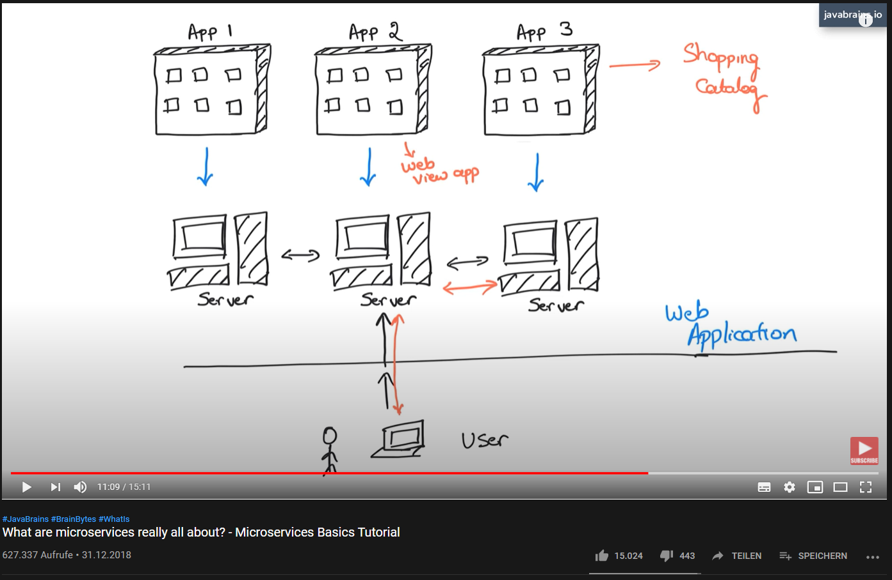

## Links
https://www.computerwoche.de/a/was-sie-zur-devops-architektur-wissen-muessen,3547874

# Microservices
Microservices basierte Architekturen

Neben der technologischen hat das Einführen von Microservices auch Auswrkung auf Organisatorische umstellungen in agile Teams 
hoher grad an Automatisierung in Hinblick auf Entwicklung Test und Bereitstellung

Anwendung in kleinere, auf fachliche Domänen fokusierte Services zerlegt, die von eingenständigen Teams entsprechend konzipiert und umgesetzt werden.

bewährte Pattern bei der Umsetzung:
- Single Responsibility
- Separation of Concerns
- Lightweight Async Communication
- Share Nothing

Services können unabhängig voneinander entwickelt, erweitert, ersetzt, getestet werden

Bringt aber auch neue Herausforderungen:
- Management
- Monitoring
- Security

Probleme: 
- Services antworten nicht in der vorgesehenen Antwortzeit
- Andere Services sind nicht mehr unter der alten IP vorzufinden - sie wurden unter einer anderen IP gestartet
- 

Logging und Monitoring
Der Gesundheitszustand des Gesamtsystems ergibt sich durch die Summe der Zustände der einzelnen Services.

Readyness-Test
Ist ein Service erreichbar

Liveness-Test
Situationen feststellen, in denen ein Neustart des Services notwendig ist

# frameworks
- spring boot    
- MicroProfile

# URLS
https://www.ionos.de/digitalguide/websites/web-entwicklung/microservice-architecture-so-funktionieren-microservices/

https://www.youtube.com/watch?v=sSm2dRarhPo   

https://microservices.io/index.html     

What are microservices really all about? - Microservices Basics Tutorial
- https://www.youtube.com/watch?v=j1gU2oGFayY

- GOTO 2015 • Microservices at Spotify • Kevin Goldsmith
https://www.youtube.com/watch?v=7LGPeBgNFuU&feature=emb_logo

- Monolithic vs Microservice-Architecture     

# Monolithic - Architecture
- one code-base   
- here we also got seperate modules.    
- we package everythin up as the application

Simple to:   
 - develop   
 - test    
 - scale    
 
problems:    
 - the application grows  
 - Skalierbarkeit   
   - man kann nur die komplette Anwendung Skalieren. Nicht einzelne Teile der Anwendung, die es nötig hätten
   - 
 
# Microservice - Architecture

the microservice architectural style is an approach to developing a single application as a suite of small services, each running in its own process and communicating with lightweight mechanisms, often an HTTP resource API. (Martin Fowler) (Quelle - minute 8:22 :https://www.youtube.com/watch?v=CZ3wIuvmHeM)   

Vorteile   
 - einzelne Teams die unabhängig an einem Service arbeiten    
 - skaliert einzeln    
 - deployed einzeln    
 - es können pro Service unterschiedliche technologien verwendet werden.     
   es muss sich nur auf eine Schnittstelle geeinigt werden (REST).     

Nachteile   
 - es gibt mehere unabhängige Service die gewaret werden können    
 - komplexität im Testen einer verteilten Systems
 
 
Issues to address     
 - How to deploy the services?   
 - Hot do the services communicate?   
 - How do clients of the application communicate with the services?   
 - How to partition the seystem into services?   
 - How to deal with distributed data management problems?   
 
 Example a microservices
 

# Service discovery
Info: https://www.youtube.com/watch?v=GboiMJm6WlA    
Wenn ein Client ein Service aufrufen möchte, brauch er die Adresse vom Service.    
Propblem: Adresse ändert sich.    
Hierfür gibt es unterschiedliche Lösungen, die entweder auf dem Client oder Service platziert werden.    

