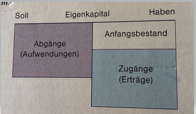

# GDPdU

unterschiedliche Typen je Firma (Lexware, Stotax, datev) diese können wir in scopevisio importieren (diese Formate unterstützen wir).  
Prüfer importeiren sich diese Datei nnd müssen ebenfalls die Formate lesen können.  
Scope hat also auch ein eignes Export-Format.  
  
ist für den prüfer aber man kann darüber auch ein import/export organisieren um auf eine andere sowtware zu migrieren (zb von e+s zu scopevisio).  
da viele so ein import/exporrt haben, ist das ein gutes mittel dies zu tun.  

In der Scope zu finden: Import/Export -> Finanzimporte verwalten -> Allgemeines GDPdU-Archive importieren
idea - export - idea ist das tool der wirtschaftsprüfer wir haben einen gezahlt um unseren export zu handeln und in die steuersoftware zu importieren

# Zugpferd (Rechnung)

Sind zusätzliche Informationen in einer PDF im XML-Format.
Die XML-Datei enthält informationen über die PDF-Datei.
Die XML ist eingebettet im PDF-File. Kombiniert das PDF-Format mti einer integrierten Rechnungsdatei im XML-Format.   
Bei einer Rechnung also die einzelnen Positionen, Beträge usw.
Wenn man dann so eine PDF bekommen, muss man kein OCR durchführen, sondern nur die XML-Datei parsen.

Benutzt in der B2C-Geschäftsbeziehung

# XRechnung
Ähnlet Zugpferd - Zugpferd liefert ein lesbares Dokument - die pdf und eine xml. man kann es also lesen(pdf) und verarbeiten(xml).
Bei der XRechnung gibt es nur den Datensatz - es gibt demnach kein Bild(pdf).   

Die XRechnung betrifft nur Kunden, die Rechnungen an bspw. Behörden oder behördennahe Einrichtungen stellen.    
Dh. man schickt der behörde eine XRechnung.   
B2B und B2C ist nicht betroffen - sonder nur B2G (Government).
Ab dem 27.11.20 ist die XRechnung verpflichtend wenn der Betrag über 1000€ liegt.
Die XRechnung besteht ausschießlich aus einem reinen Datensatz   
__LeitwegId__ vergleichbar der Anschrift - diese Hinterlegt man beim Debitor. Die LeitwegId bekommt man von der Behörde. Eine eindeutige ID.   

Die XRechnung wird lokal gespeichert. Und dann lässt man sie der Behörde zukommen, auf dem Weg den sie preferiert (demnach keine Übertragung per API).    
Die meisten behörden benutzen Portale oder per EMail.    

# Avise

Sind zusätzliche Informationen, die bei einer Überweisung mitgeschickt werden.   
In das Verwendungszweck der Überweisung passen nicht viele Informationen.   
In der Avise sind zusätzliche Informationen zu einer Überweisung.
Eine überweisung und in der Avise ist die Aufschlüsselung was damit bezahlt wurde.
Es wurde also eine Überweisung für mehrere Offene Posten getätigt.
Die Avise ist eine zusätzliche PDF-Datei.

# Kreditor / Vendor
Lieferant - wir schulden ihm Geld    

# Debitor / Customer
Kunde - er schuldet uns Geld    

# Aktiva / Passiva
(nicht zu verwechseln mit Soll und Haben)  
es sind zwei verschiedene Blickwinkel auf das Vermögen eines Unternehmens  

### Aktiv-Konten (Vermögenskonten)
Stehen im Eröffnungsbilanzkonto links

Welches Vermögen dem Unternehmen zur Verfügung steht. Mit dem man aktiv arbeiten kann.  
z.B. Bankguthaben  
Wird als __Vermögen__ bezeichnet  
Aktivseite:  

Anlagevermögen (Mittel- & Langfristig festgelegt): Grundstücke, Maschinen, Lizenzen

Umlaufvermögen: Kurzfristig festgesetzt (Rohstoffe, Kassenbestände, Bankguthaben)

### Passiv-Konten (Schuldkonten)
Stehen im Eröffnungsbilanzkonto rechts
Wie das Vermögen des Unternehmens finanziert wurde. Woher kommt das Vermögen?  
z.B. Eigenkapital  
Wird als __Kapital__ bezeichnet.

__Eigenkapital__  
Stammkapital  
Grundkapital  
Jahresüberschuss/Jahresfehlbetrag  
Bilanzgewinn/Bilanzverust  

# Soll / Haben

- Aktiv-Konten mehren sich im Soll  
- Passiv-Konten mehren sich im Haben  

- Kreditoren-konten mehren sich im Haben
- Kreditoren-konten mindern sich im Soll

- Debitoren-konten mehren sich im Soll
- Debitoren-konten mindern sihc im Haben

# Grundbuch / Hauptbuch / Nebenbuch

__Grundbuch__  
Das Grundbuch (Journal) beinhaltet alle Geschäftsvorfälle in zeitlicher Reihenfolge. Chronologisch geführt.

__Hauptbuch__  
Das Hauptbuch erfassst alle Geschäftsvorfälle aus dem Grundbuch auf Konten.  
Enthält die Sachkotnen.

__Nebenbuch__  
Sie ergänzen bzw. erläutern die Kopnten des Hauptbuchs. Zum Beispiel das Lohn- und Gehaltsbuch.  
Enthält die Personenkonten.  

# Personen und Sachkonten
__Personenkonto__  
Debitor / Kreditor - Nebenbuch

__Sachkonto__  
Konten des Hauptbuchs, die über das Schlussbilanzkonto oder das GuV abgeschlossen werden

# Erfolgskonten
(ℹ️ Eigenkapital ist ein Passiv-Konto.)  
Erfolgskonten: Aufwands-Konten &Ertrags-Konten

Dienen dazu um das Eigenkapital zu verändern.  

Eigenkapitalveränderung werden nicht direkt auf em Eigenkapitalkonto (Passiv-Konto) erfasst sondern zunächst auf besondere Konten.  
Erfolgskonten stellen sich somit als Unterkonten des Eigenkapitals dar.  

### Erträge und Aufwändungen
Zugänge beim Eigenkapital = Erträge  
 
Abgänge beim Eigenkapital = Aufwendungen  

werden wie das Eigenkapitalkonto bebucht:  
Soll = Aufwendungen  
Haben = Erträge  

# 4 Regeln für alle Buchungen
- Jede Buchung wird doppelt ausgeführt
- Aktiv-Konten mehren sich im Soll (Passiv-Konten somit im Haben)
- Aufwands-Konten mehren sich im Soll (Ertrags-Konten somit im Haben)
- Die Soll-Seite wird stets zuerst angesprochen (__Soll an Haben__)

__Verbindlichkeiten__  
Aus Lieferung & Leistungen  
Gegenüber Kreditinstituten  

__Infos__  
- Die Summe der aktiven Seite entspricht immer der der passiven Seite.  
- Es gibt aktive und passive Bestandskonten (Aktiva/Passiva sind also Konto-ARTEN)

