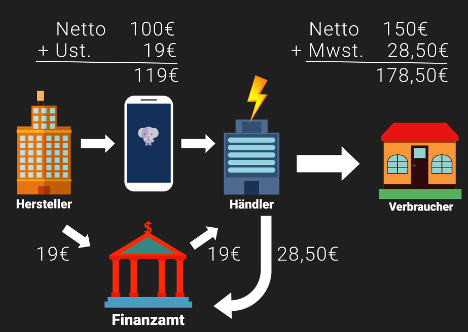

# Mehrwertsteuer / Umsatzsteuer

### Umsatzsteuer
Umsatzsteuer ist die Steuer die gezahlt werden muss, wenn ein Unternehmer etwas verkauft.  
Steuer auf Umsätze des Unternehmens.  

### Vorsteuer
ist die Steuer die ein Unternehmer zahlt wenn er waren oder Dienstleistungen von einem anderen Unternehmer kauft  
 
__Umsatzsteuer und Vorsteuer beschreiben die gleiche Steuer__  
Käufer: Vorsteuer  
Verkäufer: Umsatzsteuer  

### Hersteller → Händler
Der Händler bestellt beim Hersteller ein neues Handy.  
Der Hersteller bekommt für das Handy 100€ Netto.  
Darauf kommen 19% → 19€ Umsatzsteuer, da der Hersteller Umsatz macht, wenn er seine Ware verkauft.  
Der Händler zahlt an den Hersteller demnach 119€.  
Die 19€ führt der Hersteller an das Finanzamt ab. Ihm bleiben die 100€  
In diesem Moment hat der Händler die 19€ Umsatzsteuer bezahlt.  

### Händler → Verbraucher
Der Händler Verkauft das Handy für 150€.  
Er schaffte ein __Mehrwert__ von 50€.  
Darauf kommen 19% Mehrwertsteuer → 28,50€  
Der Kunde zahlt demnach __178,50€__.  

Der Händler gibt die 28,50€ die er vom Kunden bekommen hat an das Finanzamt und bekommt somit auch die Vorsteuer in Höhe von 19€ zurück, die er beim Kauf bezahlt hat.  
In den 28,50€ sind die 19% (19€) Vorsteuer drin SOWIE die 19% auf die 50€ Gewinn.  

__Man kann das auch so aufbröseln:__  
100€ + 19% = __119 €___ (das rechnet der Händler so, damit er seine 19€ die er für den Kauf bezahlt hat zurückbekommt)  
er muss aber noch 19% auf sein Gewinn berechnen, die wälzt er auch an den Käufer ab:  
50€ + 19% (9,50€) = __59,50 €__  
Zusammen ergibt das 119 € + 59,90 € = __178,5 €__

Das gleiche Ergebnis bekommt man, wenn man geleich auf den Gesamtbetrag 19% berechnet:   
100€ + 50€ = 150 €   
19% von 150€ = 28,50 €  
demnach __178,5 €__

### Fazit
Am Ende zahlt der Kunde die Steuer:  
Erst zahlte der Händler an den Hersteller 19€. Der Hersteller gab diese dem Finanzamt.  
Der Händler bekam diese durch die Steuer vom Kunden zurück.  
Der Kunde zahlte 28,50€ Steuern.  
Differenz 9,5€. 19% von 50€ (dem Mehrwert) sind 9,5€.  
Der Kunde zahlt auch die Steuer auf den geschaffenen Mehrwert.  

### Umsatzsteuervoranmeldung
Bei der Umsatzsteuervoranmeldung bekommt der Händler die Steuern (19€) zurück, die er dem Hersteller bezahlt hat.
